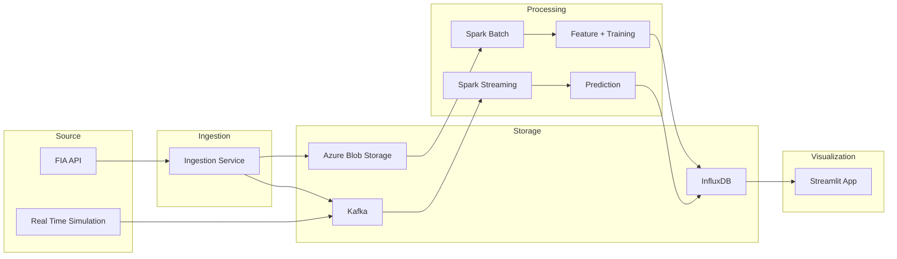

# F1-Chubby-Data: System Architecture & Demo Plan

## Overview

A big-data pipeline for Formula 1 race analytics and real-time prediction, built as a Final Term Project demo. The system ingests historical and live (simulated) F1 data through a multi-layer architecture: ingestion, storage, batch/stream processing, and visualization — all running on Azure managed services.

The Streamlit dashboard reads **exclusively from InfluxDB**, with no direct API calls. During a live/simulated race, visualization of race data is **never blocked** by prediction — the two streaming paths are fully decoupled.

## Architecture

---

## Component Specification

### 1. Source Layer

#### FIA API

- **Role:** Primary data source for historical F1 data.
- **Scope:** Pull as many seasons as possible (2018–2025+) — more data improves model quality and dashboard richness.
- **Data includes:** Race calendars, session results, qualifying times, lap times, pit stops, driver/constructor standings, telemetry, race control messages.
- **Interaction:** Feeds into the Ingestion Service (`FIA --> ING`).

#### Real Time Simulation

- **Role:** Replays a pre-cached historical race into Kafka, simulating a live race feed for demo day.
- **Why needed:** Cannot guarantee a real race on demo day.
- **Behavior:**
  - Reads pre-extracted telemetry for a historical race (stored as parquet/JSON).
  - Publishes to three Kafka topics at configurable speed (e.g., 5× → ~18 min race).
  - Produces directly to Kafka (`SIM --> KAFKA`), bypassing Ingestion.
- **Kafka topics produced:**
  - `f1-telemetry` — Car positions, speed, throttle, brake, gear, DRS (high frequency, ~10 Hz per car).
  - `f1-timing` — Lap completions, positions, gaps, tyre compound, stint info (per lap per car).
  - `f1-race-control` — Flags, safety car, incidents (event-driven, sparse).
- **Configuration:**
  - `REPLAY_SPEED` — Speed multiplier (default `5.0`).
  - `REPLAY_RACE` — Which cached race to replay (e.g., `2024_bahrain_R`).
- **Pre-caching:** A one-time local script extracts a full race session from FastF1, interpolates all cars to a unified 10 Hz timeline, and uploads the result to Blob under `replay-cache/`.

### 2. Ingestion Layer

#### Ingestion Service

- **Role:** Bridges the FIA API to storage. Normalizes raw API responses and routes them to the appropriate stores.
- **Outputs:**
  - **To Blob** (`ING --> BLOB`): Raw session data, partitioned as `/raw/{year}/{round}/{session}/`. Used by the batch processing path.
  - **To Kafka** (`ING --> KAFKA`): Publishes ingestion-complete events and any near-real-time data available from the API.
- **Implementation:** Python service. Handles API rate limits, retries, and resumable crawling.

### 3. Storage Layer

#### Azure Blob Storage

- **Role:** Durable store for raw historical data and model artifacts.
- **Containers:**
  - `raw/` — Raw session data from Ingestion, partitioned by year/round/session.
  - `ml-models/` — Trained model artifacts (serialized scikit-learn model).
  - `replay-cache/` — Pre-extracted race telemetry for the Simulation Service.
- **Azure SKU:** GPv2, LRS, Hot tier.

#### Kafka (Azure Event Hubs)

- **Role:** Streaming message bus for live/simulated race data.
- **Topics (Event Hubs):**
  - `f1-telemetry` — High-frequency car telemetry.
  - `f1-timing` — Per-lap timing data.
  - `f1-race-control` — Race director messages and flags.
- **Azure SKU:** Event Hubs Standard, 1 Throughput Unit, Kafka protocol enabled.
- **Retention:** 1 day (sufficient for demo).

#### InfluxDB

- **Role:** The single serving database for the Streamlit app. Stores both historical (batch-processed) and live (stream-processed) data.
- **Deployment:** InfluxDB 2.x OSS in Docker on an Azure VM.
- **Measurements/Buckets:**

  | Bucket              | Source                      | Contents                                                     | Retention |
  | ------------------- | --------------------------- | ------------------------------------------------------------ | --------- |
  | `race_calendar`     | Spark Batch                 | Season schedules, event dates, circuits                      | Infinite  |
  | `session_results`   | Spark Batch                 | Finishing order, grid, points, status per driver per session | Infinite  |
  | `driver_standings`  | Spark Batch                 | Championship points after each round                         | Infinite  |
  | `lap_times`         | Spark Batch                 | Historical lap-by-lap times, compounds, stints               | Infinite  |
  | `telemetry_summary` | Spark Batch                 | Aggregated telemetry (sector speeds, top speeds) per session | Infinite  |
  | `live_positions`    | Spark Streaming (fast path) | Real-time car X/Y, speed — high frequency                    | 7 days    |
  | `live_timing`       | Spark Streaming (fast path) | Real-time lap times, gaps, positions — per lap               | 7 days    |
  | `live_race_control` | Spark Streaming (fast path) | Real-time flags, safety car, incidents                       | 7 days    |
  | `predictions`       | Spark Streaming (slow path) | Podium probabilities, position predictions — async           | 7 days    |

- **Azure SKU:** B2als v2 VM (2 vCPU, 4 GB RAM) + 30 GB Standard SSD.

### 4. Processing Layer

#### Spark Batch (`BLOB --> SPARKB --> FE --> INFLUX`)

- **Role:** Processes all historical data from Blob into features, trains the ML model, and populates InfluxDB with everything the dashboard needs for historical views.
- **Jobs:**
  1. **Feature Engineering** — Read raw data from Blob, compute ML features (grid position, qualifying delta, pace delta, driver form, team tier, tyre strategy metrics).
  2. **Model Training** — Train a scikit-learn RandomForest classifier on engineered features. Save model artifact to Blob (`ml-models/`).
  3. **Historical Data Load** — Write processed historical data (calendar, results, standings, lap times, telemetry summaries) into InfluxDB so the Streamlit app can serve every view from the DB.
- **Platform:** Azure Databricks, single-node Jobs Compute cluster (D4as v5), auto-terminate after 10 min idle.

#### Spark Streaming (`KAFKA --> SPARKS --> MODEL --> INFLUX`)

- **Role:** Consumes live/simulated race data from Kafka and writes to InfluxDB via two decoupled paths.
- **Critical design principle:** Visualization must never be blocked by prediction.

##### Fast Path (Visualization Data)

- **Input:** `f1-telemetry`, `f1-timing`, `f1-race-control` topics from Kafka.
- **Processing:** Lightweight transformation — parse JSON, enrich with driver/team metadata, convert timestamps.
- **Output:** Writes to InfluxDB `live_positions`, `live_timing`, `live_race_control`.
- **Latency:** Low (sub-second micro-batches). No model dependency.
- **Failure isolation:** If this job fails, only live visualization is affected. Predictions continue independently.

##### Slow Path (Prediction)

- **Input:** Same Kafka topics (separate consumer group).
- **Processing:** Windowed feature computation (rolling averages, gap trends, tyre degradation curves) + load trained model from Blob + run inference.
- **Output:** Writes to InfluxDB `predictions` measurement with a timestamp indicating prediction freshness.
- **Latency:** Higher (5–10 second windows acceptable). Model inference adds compute time.
- **Failure isolation:** If prediction lags or crashes, live race visualization is completely unaffected.

##### Implementation: Two Separate Spark Streaming Jobs

- **Why two jobs, not one:** Full process isolation. A prediction crash or slowdown cannot impact visualization data flow. The marginal cost difference is negligible for a short demo window.
- **Platform:** Azure Databricks, each on its own single-node Jobs Compute cluster, auto-terminate after 10 min idle.

### 5. Visualization Layer

#### Streamlit App

- **Role:** The user-facing dashboard. Reads exclusively from InfluxDB.
- **Data source:** All queries go to InfluxDB via the InfluxDB Python client. Zero direct FIA API / FastF1 calls.
- **Views powered by batch data (historical):** Calendar, session results, driver/constructor standings, historical lap times, strategy analysis, telemetry comparisons.
- **Views powered by streaming data (live race):**
  - **Live race tracker** — Car positions on track, updated from `live_positions` (fast path).
  - **Live timing board** — Gaps, lap times, tyre info from `live_timing` (fast path).
  - **Race control feed** — Flags and messages from `live_race_control` (fast path).
  - **AI Predictions panel** — Podium probabilities from `predictions` (slow path), displayed with a **staleness indicator** showing the timestamp of the last prediction update. This makes the latency tradeoff visible and is a strong demo talking point.
- **Deployment:** Azure App Service, B1 Linux.

---

## Azure Infrastructure

### Resource Group Contents

| Resource             | Azure Service | SKU                           | Purpose                               |
| -------------------- | ------------- | ----------------------------- | ------------------------------------- |
| Event Hubs Namespace | Event Hubs    | Standard, 1 TU, Kafka-enabled | Kafka message bus                     |
| Storage Account      | Blob Storage  | GPv2, LRS, Hot                | Raw data, models, replay cache        |
| Virtual Machine      | Compute       | B2als v2 (2 vCPU, 4 GB)       | Hosts InfluxDB + Simulation Service   |
| Databricks Workspace | Databricks    | Premium                       | Spark Batch + 2× Spark Streaming jobs |
| App Service          | App Service   | B1 Linux                      | Streamlit dashboard                   |

### Estimated Cost (8 days: 7 dev + 1 demo)

| Component                               | Est. Cost |
| --------------------------------------- | --------- |
| Event Hubs (1 TU, 8 days)               | ~$6       |
| Blob Storage (~3–5 GB)                  | ~$0.15    |
| VM + disk (B2als v2, 8 days)            | ~$8       |
| Databricks Jobs Compute (~10 hrs total) | ~$5       |
| App Service (B1, 8 days)                | ~$3.50    |
| **Total**                               | **~$23**  |

> Budget recommendation: ~$35 with 50% buffer. Delete the Resource Group immediately after demo to stop all billing.

### Cost-Saving Practices

- Deallocate the VM when not actively developing.
- Auto-terminate Databricks clusters after 10 min idle.
- Use 1-day retention on Event Hubs.
- Delete the entire Resource Group after the demo.

---

## Task Breakdown

### Phase 0: Local Preparation (no Azure cost)

| #   | Task                                                                                        | Depends On | Est. Effort |
| --- | ------------------------------------------------------------------------------------------- | ---------- | ----------- |
| 0.1 | Design InfluxDB measurement schemas (all buckets, tag keys, field keys, retention policies) | —          | 3 hrs       |
| 0.2 | Implement/recover MLCore.py (model training + prediction interface)                         | —          | 4 hrs       |
| 0.3 | Build bulk data crawler: pull 2018–2025+ historical data from FIA API, save to local files  | —          | 4 hrs       |
| 0.4 | Build Simulation Service: read cached race → replay to Kafka at configurable speed          | —          | 4 hrs       |
| 0.5 | Pre-cache 2–3 race replays as parquet files                                                 | 0.4        | 1 hr        |
| 0.6 | Dockerize InfluxDB + Simulation Service (docker-compose for local testing)                  | 0.1, 0.4   | 2 hrs       |
| 0.7 | Dockerize Streamlit app                                                                     | —          | 1 hr        |

### Phase 1: Azure Infrastructure Provisioning

| #   | Task                                                                            | Depends On | Est. Effort |
| --- | ------------------------------------------------------------------------------- | ---------- | ----------- |
| 1.1 | Create Resource Group + Storage Account, upload raw data + replay cache to Blob | 0.3, 0.5   | 30 min      |
| 1.2 | Create Event Hubs namespace (Standard, Kafka-enabled) + 3 Event Hubs            | —          | 15 min      |
| 1.3 | Create VM, install Docker, deploy InfluxDB container, initialize buckets/schema | 0.1        | 30 min      |
| 1.4 | Create Databricks Workspace                                                     | —          | 15 min      |
| 1.5 | Create App Service for Streamlit                                                | —          | 15 min      |

### Phase 2: Pipeline Integration

| #   | Task                                                                                                                  | Depends On         | Est. Effort |
| --- | --------------------------------------------------------------------------------------------------------------------- | ------------------ | ----------- |
| 2.1 | Implement Ingestion Service: FIA API → Blob + Kafka                                                                   | 1.1, 1.2           | 4 hrs       |
| 2.2 | Spark Batch notebook: Blob → feature engineering → train model → save to Blob + write all historical data to InfluxDB | 1.1, 1.3, 1.4, 0.2 | 6 hrs       |
| 2.3 | Spark Streaming job (fast path): Kafka → lightweight transform → InfluxDB live measurements                           | 1.2, 1.3, 1.4      | 4 hrs       |
| 2.4 | Spark Streaming job (slow path): Kafka → windowed features → model predict → InfluxDB predictions                     | 1.2, 1.3, 1.4, 2.2 | 5 hrs       |
| 2.5 | Configure Simulation Service on VM to produce to Event Hubs                                                           | 1.2, 1.3, 0.4      | 2 hrs       |
| 2.6 | Rework Streamlit app: replace all FastF1/API calls with InfluxDB queries, add prediction staleness indicator          | 1.5, 0.1           | 6 hrs       |
| 2.7 | Deploy Streamlit app to App Service                                                                                   | 2.6                | 1 hr        |

### Phase 3: End-to-End Testing

| #   | Task                                                                                                      | Depends On | Est. Effort |
| --- | --------------------------------------------------------------------------------------------------------- | ---------- | ----------- |
| 3.1 | Run Spark Batch end-to-end, verify all historical data in InfluxDB                                        | 2.2        | 1 hr        |
| 3.2 | Start Simulation → verify events arrive in Event Hubs                                                     | 2.5        | 30 min      |
| 3.3 | Start fast-path streaming → verify live data in InfluxDB within 1 sec                                     | 2.3, 3.2   | 1 hr        |
| 3.4 | Start slow-path streaming → verify predictions in InfluxDB (independent of fast path)                     | 2.4, 3.2   | 1 hr        |
| 3.5 | Open Streamlit → verify historical views from batch data                                                  | 2.7, 3.1   | 30 min      |
| 3.6 | Open Streamlit → verify live views update from fast path, predictions update independently from slow path | 3.3, 3.4   | 1 hr        |
| 3.7 | Kill slow-path job → confirm live visualization continues uninterrupted                                   | 3.6        | 15 min      |
| 3.8 | Full dress rehearsal: complete demo flow at 5× speed                                                      | 3.1–3.7    | 2 hrs       |

### Phase 4: Demo Day

| #   | Task                                                                       | Depends On | Est. Effort |
| --- | -------------------------------------------------------------------------- | ---------- | ----------- |
| 4.1 | Start VM (InfluxDB + Simulation Service)                                   | 3.8        | 5 min       |
| 4.2 | Start both Databricks Streaming clusters                                   | 3.8        | 3 min       |
| 4.3 | Verify Streamlit app is live                                               | 3.8        | 1 min       |
| 4.4 | Run demo: architecture walkthrough (~3 min) + live simulation (~15–18 min) | 4.1–4.3    | 20 min      |
| 4.5 | **Tear down: Delete Resource Group**                                       | 4.4        | 5 min       |

**Total estimated effort: ~55–60 person-hours**

---

## Key Design Decisions

### 1. Decoupled Streaming Paths

The Spark Streaming layer is split into two independent jobs:

- **Fast path** handles visualization data with minimal transformation and sub-second latency.
- **Slow path** handles prediction with windowed features and model inference.

This ensures that during a live/simulated race, the dashboard always shows up-to-date race data regardless of prediction pipeline health or latency.

### 2. Streamlit Reads Exclusively from InfluxDB

No direct API calls from the dashboard. This means:

- The Spark Batch job must populate InfluxDB with **all** historical data the dashboard needs.
- The InfluxDB schema must be designed first (Phase 0, Task 0.1) before any other work begins.
- This is architecturally pure and matches the diagram exactly (`INFLUX --> UI`).

### 3. Simulation Service Bypasses Ingestion

Per the architecture diagram, `SIM --> KAFKA` is a direct edge. The Simulation Service writes directly to Kafka, not through the Ingestion Service. This is intentional — during a live race, the Ingestion Service would handle real API data; during demo, the Simulation Service substitutes it.

### 4. Two Separate Streaming Jobs Over One Forked Job

Full process isolation at marginal additional cost. A crash or backpressure in prediction cannot propagate to visualization. For a demo where reliability matters, this is the right tradeoff.
