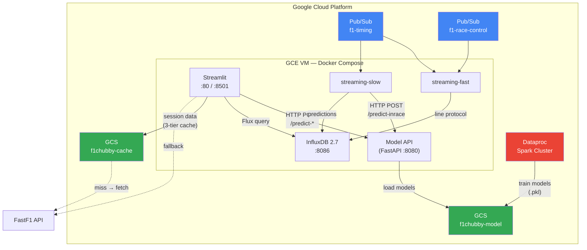

# F1 Data Analytics & Live Race Predictor

A Formula 1 data analytics and real-time prediction system built on **GCP**. Combines a Streamlit dashboard, FastAPI model-serving microservice, InfluxDB time-series store, and Spark-based streaming pipelines to deliver race strategy visualizations, telemetry analysis, and ML-powered win/podium probability predictions lap-by-lap.

## Key Features

- **Real-time Simulation & Leaderboard** — simulates a live race data stream with a continuously updating Timing Tower and Interval/Gap tracking
- **Dynamic ML Predictor** — Random Forest models infer Win and Podium probabilities lap-by-lap, visualized through Sparklines and Radar Charts
- **Track Dominance & Telemetry** — speed, throttle, and RPM analysis across mini-sectors
- **Pre-race Predictions** — podium probability for Top 10 drivers, quadrant-based setup profiler, and AI tactical analysis (Google Gemini)
- **Interactive Race Replay** — JavaScript-based 2 Hz car position replay with interpolated telemetry
- **Comprehensive Analytics** — lap times, tire strategies, position changes, and season standings

## Tech Stack

| Layer | Technology |
|-------|-----------|
| Frontend | Streamlit, Altair, Plotly |
| ML Serving | FastAPI, scikit-learn (Random Forest), Joblib |
| Time-series DB | InfluxDB 2.7 |
| Streaming | Google Pub/Sub, Python pull consumers |
| Training | PySpark on Google Dataproc |
| Data | FastF1 API, Google Cloud Storage (3-tier cache) |
| LLM | Google Gemini (tactical race briefing) |
| Infra | Terraform → GCE, VPC, Pub/Sub, GCS, Dataproc |
| CI/CD | GitHub Actions (4 workflows), Workload Identity Federation (keyless) |

---

## Architecture

### System Diagram



### Component Overview

| Component | Directory | Description |
|-----------|-----------|-------------|
| **Streamlit Dashboard** | `main.py`, `pages/`, `components/` | 5-page UI: home, race analytics, race details (8 tabs), drivers, constructors. Polls InfluxDB every 3 s for live data. |
| **Model Serving API** | `model_serving/` | FastAPI microservice exposing `POST /predict-prerace` and `POST /predict-inrace`. Loads 3 Random Forest `.pkl` models from GCS (prod) or local bind mount (dev). |
| **Core Backend** | `core/` | Data loading with 3-tier cache (`local → GCS → FastF1`), ML feature engineering, GCS utilities, configuration. |
| **Streaming — Fast Path** | `streaming/streaming_fast.py` | Pulls from Pub/Sub `f1-timing` + `f1-race-control` subscriptions, converts to InfluxDB line protocol, writes in ~500 ms micro-batches. |
| **Streaming — Slow Path** | `streaming/streaming_slow.py` | Pulls from Pub/Sub `f1-timing` subscription, batches by driver, calls Model API for predictions, writes results to InfluxDB (~10 s cycle). |
| **Training Pipeline** | `spark/training_pipeline.py` | PySpark job extracting pre-race and in-race features from 2024–2026 FastF1 data, trains Random Forest models, uploads `.pkl` to GCS. |
| **Infrastructure** | `infra/` | Terraform modules: networking, pubsub, storage, compute, dataproc, cloudrun. |
| **CI/CD** | `.github/workflows/` | 3 workflows: `deploy-vm` (auto on push to main), `deploy-dataproc` (manual), `terraform` (auto on infra changes). |

### Data Flow

```
Streamlit page request
  │
  ├─ Calendar / Results / Standings / Telemetry / Laps
  │   └─ core/data_loader.py  ──→  1. Check local f1_cache/
  │                                 2. Check GCS bucket
  │                                 3. Fall back to FastF1 API
  │                                 4. Upload result to GCS async (background thread)
  │
  ├─ ML Prediction (pre-race or live)
  │   └─ HTTP POST → model-api:8080/predict-prerace or /predict-inrace
  │
  └─ Live Race Data (timing tower, race control, predictions)
      └─ Flux query → InfluxDB:8086/live_race bucket
```

### Pub/Sub Message Schemas

Two topics carry real-time race data. Full JSON schemas are in `schemas/`.

| Topic | Schema | Rate | Key Fields |
|-------|--------|------|----------|
| `f1-timing` | [`schemas/timing.json`](schemas/timing.json) | 1 per driver per lap | `position`, `lap_time_ms`, `gap_to_leader_ms`, `tyre_compound`, `tyre_age_laps` |
| `f1-race-control` | [`schemas/race_control.json`](schemas/race_control.json) | Event-driven | `flag` (GREEN/YELLOW/RED), `scope`, `message` |

### ML Models

Three Random Forest classifiers trained on 2024–2026 historical data:

| Model | File | Input Features | Output |
|-------|------|---------------|--------|
| Pre-race Podium | `podium_model.pkl` | `GridPosition`, `TeamTier`, `QualifyingDelta`, `FP2_PaceDelta`, `DriverForm` | P(podium) per driver |
| In-race Win | `in_race_win_model.pkl` | `LapFraction`, `CurrentPosition`, `GapToLeader`, `TyreLife`, `CompoundIdx`, `IsPitOut` | P(win) per driver |
| In-race Podium | `in_race_podium_model.pkl` | Same as in-race win | P(podium) per driver |

Predictions are normalized so total win expectation = 1.0 and total podium expectation = 3.0.

---

## Directory Structure

```
F1-Chubby-Data/
├── main.py                      # Streamlit entry point
├── Dockerfile                   # Streamlit container image
├── docker-compose.yml           # Production stack (5 services)
├── docker-compose.dev.yml       # Dev stack (3 services, hot reload)
├── requirements-streamlit.txt   # Streamlit dependencies
├── .env.example                 # Production env var template
├── .env.dev.example             # Development env var template
│
├── pages/                       # Streamlit multi-page app
│   ├── home.py                  # Season overview, standings, countdown
│   ├── race_analytics.py        # Race calendar + video intro
│   ├── details.py               # Analytics tabs for a selected race
│   ├── drivers.py               # Driver standings
│   └── constructors.py          # Constructor standings
│
├── components/                  # Reusable UI modules
│   ├── tab_live_race.py         # Live simulation (Timing Tower, ML Inspector)
│   ├── tab_telemetry.py         # Telemetry charts
│   ├── tab_track_dominance.py   # Track dominance map
│   ├── tab_lap_times.py         # Lap time comparison
│   ├── tab_strategy.py          # Tire strategy
│   ├── tab_positions.py         # Position changes
│   ├── tab_results.py           # Race classification
│   ├── tab_race_control.py      # Race control messages
│   ├── predictor_ui.py          # Pre-race prediction UI + Gemini tactical briefing
│   └── replay_engine.py         # Interactive race replay (2 Hz, JavaScript)
│
├── core/                        # Backend logic
│   ├── data_loader.py           # GCS + FastF1 data loading with 3-tier cache
│   ├── ml_core.py               # ML feature engineering (pre-race + in-race)
│   ├── config.py                # Constants, team colors, country flags, CSS
│   ├── data_crawler.py          # Historical data crawler → GCS
│   └── gcs_utils.py             # GCS utility functions
│
├── model_serving/               # ML prediction microservice
│   ├── app.py                   # FastAPI endpoints (/predict-prerace, /predict-inrace)
│   ├── Dockerfile               # Model API image
│   ├── requirements.txt         # ML dependencies
│   └── README.md                # Local deployment & API reference
│
├── streaming/                   # Pub/Sub → InfluxDB consumers
│   ├── streaming_fast.py        # Fast path: timing + race control → InfluxDB (~500 ms)
│   ├── streaming_slow.py        # Slow path: timing → Model API → predictions → InfluxDB (~10 s)
│   ├── Dockerfile               # Consumer image
│   └── README.md                # Local deployment guide
│
├── spark/                       # Spark jobs (run on Dataproc)
│   ├── training_pipeline.py     # Feature extraction + model training → GCS
│   ├── streaming_fast.py        # Dataproc version of fast consumer
│   ├── streaming_slow.py        # Dataproc version of slow consumer
│   └── README.md                # Spark job execution guide
│
├── scripts/                     # Operational scripts
│   ├── infra.sh                 # Start/stop/status GCP VM
│   ├── simulate_race_to_influxdb.py  # Race simulation → InfluxDB/Pub/Sub
│   └── README.md                # Script usage guide
│
├── infra/                       # Terraform (GCP infrastructure)
│   ├── main.tf                  # Root module composition
│   ├── variables.tf / terraform.tfvars
│   ├── outputs.tf
│   ├── modules/                 # networking, pubsub, storage, compute, dataproc, cloudrun
│   └── README.md                # Terraform quick start & modules
│
├── schemas/                     # Pub/Sub message JSON schemas
│   ├── telemetry.json
│   ├── timing.json
│   └── race_control.json
│
├── docs/
│   └── deployment.md            # Production deployment runbook
│
├── assets/                      # Images, models, static files
│   ├── Models/                  # Pre-trained .pkl files
│   ├── Drivers/                 # Driver headshot images
│   ├── Teams/                   # Team logo images
│   └── BGS/                     # Track background images
│
└── f1_cache/                    # FastF1 cached session data (~800 MB)
```

---

## Quick Start (Local Dev)

```bash
# 1. Copy environment template
cp .env.dev.example .env

# 2. Start all services (Streamlit + Model API + InfluxDB)
docker compose -f docker-compose.dev.yml up --build

# 3. Open the dashboard
open http://localhost:8501
```

See [streamlit_local_dev.md](streamlit_local_dev.md) for the full local development guide, including running without Docker.

---

## Production Deployment

The production stack runs on a GCE VM via `docker-compose.yml` (Streamlit, Model API, InfluxDB). Streaming consumers run on the same VM or on Dataproc. Deployment is automated via GitHub Actions on push to `main`.

See [docs/deployment.md](docs/deployment.md) for the step-by-step production deployment runbook.

---

## Further Documentation

| Document | Description |
|----------|-------------|
| [streamlit_local_dev.md](streamlit_local_dev.md) | Local development setup, data sources, hot reload |
| [docs/deployment.md](docs/deployment.md) | Production deployment runbook, CI/CD pipelines, env var reference |
| [model_serving/README.md](model_serving/README.md) | Model API local deployment & API reference |
| [streaming/README.md](streaming/README.md) | Streaming consumer deployment |
| [spark/README.md](spark/README.md) | Spark job execution (local + Dataproc) |
| [scripts/README.md](scripts/README.md) | Operational script usage |
| [infra/README.md](infra/README.md) | Terraform infrastructure modules & quick start |
