# F1-Chubby-Data: Revised System Architecture & Demo Plan

## Overview

A big-data pipeline for Formula 1 race analytics and real-time prediction, built as a Final Term Project demo. The system ingests historical and live (simulated) F1 data through a multi-layer architecture: ingestion, storage, batch/stream processing, and visualization — all running on Google Cloud Platform (GCP).

The serving layer uses **two databases matched to workload type**: PostgreSQL for relational historical analytics, InfluxDB for time-series live streaming data. A **Model Serving API** (technology-agnostic) provides a decoupled inference endpoint for real-time predictions. During a live/simulated race, visualization of race data is **never blocked** by prediction — the two streaming paths are fully decoupled.

---

## Architecture

### High-Level Data Flow

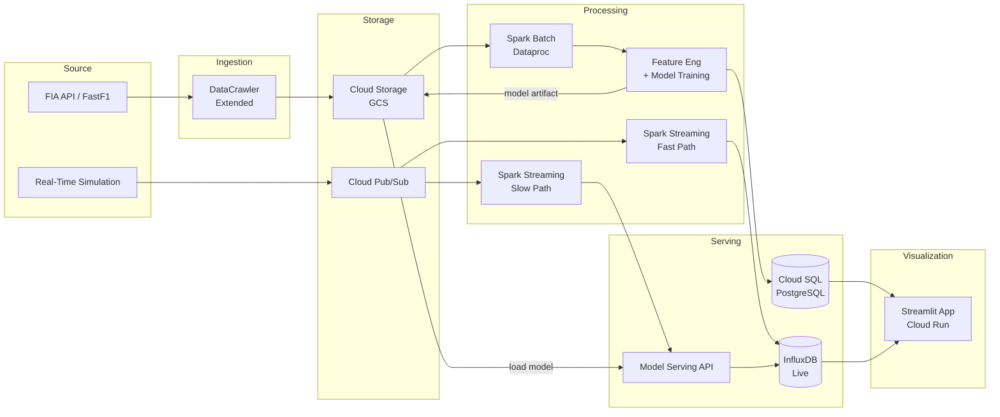

### Batch Processing Detail

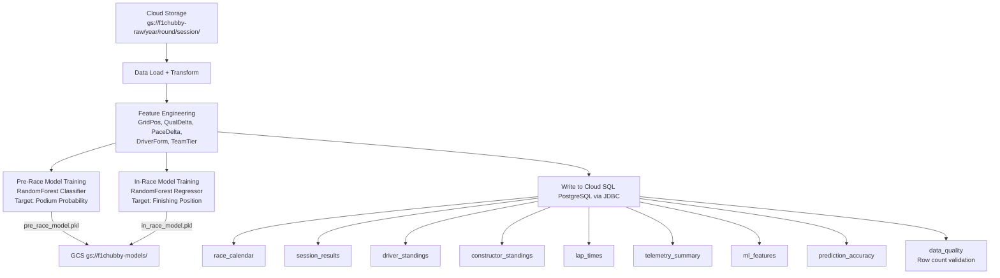

### Streaming Processing Detail

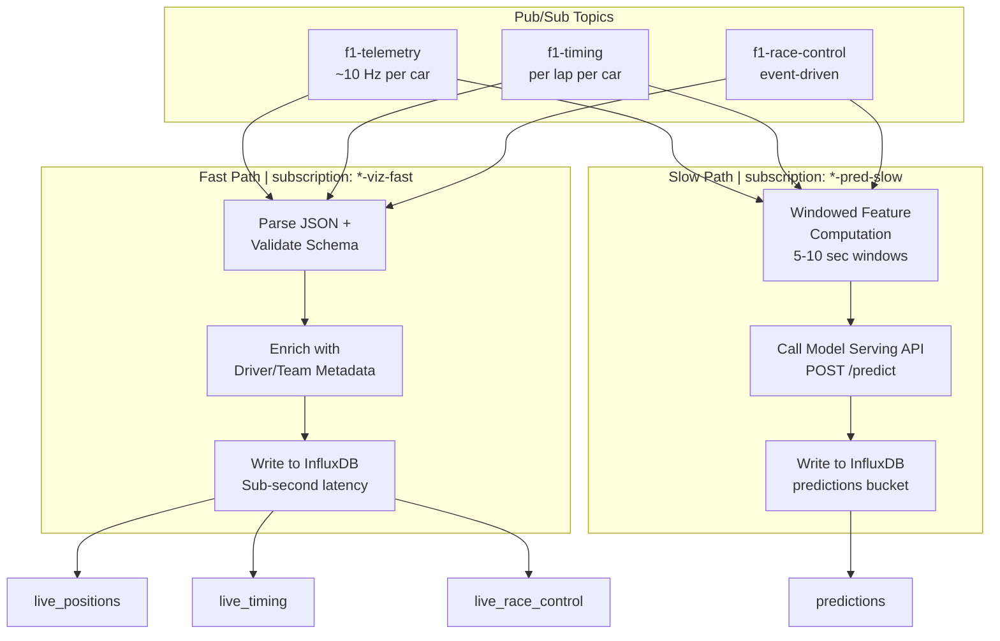

### Dual-Database Serving Strategy

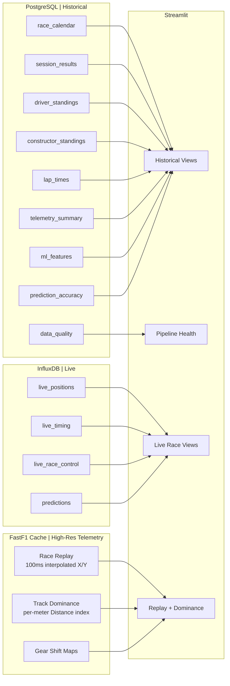

---

## Component Specification

### 1. Source Layer

#### FIA API (via FastF1)

- **Role:** Primary data source for historical F1 data.
- **Coverage:** 2019–2025 for telemetry-dependent features (telemetry quality degrades before 2019), 2018–2025 for results/standings.
- **Data includes:** Race calendars, session results, qualifying times, lap times, pit stops, driver/constructor standings, telemetry, race control messages.
- **Interaction:** Feeds into the DataCrawler (`FIA --> DC`).

#### Real-Time Simulation Service

- **Role:** Replays a pre-cached historical race into Pub/Sub, simulating a live race feed for demo day.
- **Why needed:** Cannot guarantee a real race on demo day.
- **Behavior:**
  - Reads pre-extracted telemetry for a historical race (stored as parquet/JSON in GCS under `replay-cache/`).
  - Publishes to three Pub/Sub topics at configurable speed (e.g., 5× → ~18 min race).
  - Produces directly to Pub/Sub (`SIM --> PUBSUB`), bypassing DataCrawler. This is intentional — during a real race the DataCrawler handles API data; during demo, the Simulation Service substitutes it.
- **Configuration:**
  - `REPLAY_SPEED` — Speed multiplier (default `5.0`).
  - `REPLAY_RACE` — Which cached race to replay (e.g., `2024_bahrain_R`).
- **Pre-caching:** A one-time script extracts a full race session from FastF1, interpolates all cars to a unified 10 Hz timeline, and uploads to GCS under `replay-cache/`.

### 2. Ingestion Layer

#### DataCrawler (Extended)

- **Role:** Extends the existing `DataCrawler.py` to serve as the ingestion layer. Extracts data from the FIA API via FastF1, normalizes it, saves locally, and uploads raw data to Cloud Storage.
- **Outputs:**
  - **To GCS** (`DC --> GCS`): Raw session data, partitioned as `gs://f1chubby-raw/{year}/{round}/{session}/`. Used by the batch processing path.
  - **To local CSV** (`f1_cache/historical_data_v2.csv`): ML training features (existing behavior, preserved).
- **Implementation:** Already exists as `DataCrawler.py`. Extended with `google-cloud-storage` SDK calls for GCS upload. Handles API rate limits (15s delay), retries, and resumable crawling (existing checkpoint logic).
- **Why not a separate Ingestion Service:** The DataCrawler already does extraction + normalization + resumable crawling. Adding GCS upload is ~30 lines of code. Building a separate service adds ~4 hours of work with no architectural benefit for a PoC.

### 3. Storage Layer

#### Cloud Storage (GCS)

- **Role:** Durable store for raw historical data, model artifacts, and replay cache.
- **Buckets:**
  - `f1chubby-raw/` — Raw session data from DataCrawler, partitioned by `{year}/{round}/{session}/`.
  - `f1chubby-models/` — Trained model artifacts (`pre_race_model.pkl`, `in_race_model.pkl`).
  - `f1chubby-replay/` — Pre-extracted race telemetry for the Simulation Service.
- **Storage class:** Standard, single region (`asia-southeast1`).

#### Cloud Pub/Sub

- **Role:** Streaming message bus for live/simulated race data.
- **Topics:**
  - `f1-telemetry` — High-frequency car telemetry.
  - `f1-timing` — Per-lap timing data.
  - `f1-race-control` — Race director messages and flags.
- **Subscriptions (2 per topic):**
  - `*-viz-fast` — Fast path consumer (Spark Streaming visualization job).
  - `*-pred-slow` — Slow path consumer (Spark Streaming prediction job).
- **Message Schemas:** Defined as JSON Schema documents in `/schemas/` directory. All producers and consumers reference these schemas (see [Message Schemas](#message-schemas)).
- **Retention:** 1 day (sufficient for demo).
- **Why Pub/Sub over managed Kafka:** Native GCP, simpler setup (no namespace/TU config), automatic parallelism (no partition management), cheaper for demo volume. Trade-off: not Kafka API-compatible — producer/consumer code uses `google-cloud-pubsub` SDK instead of `kafka-python`.

### 4. Serving Layer (Dual-Database)

The serving layer uses two databases, each matched to its workload type. This is a deliberate architectural decision: relational analytics need JOINs, GROUP BY, ORDER BY, and window functions; live streaming data needs fast time-indexed appends and time-range queries.

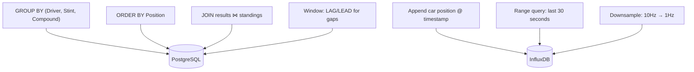

#### PostgreSQL — Historical Analytics

- **Role:** Serving database for all historical/batch-processed data.
- **Deployment:** Cloud SQL for PostgreSQL.
- **Instance:** db-f1-micro (shared-core, 0.6 GB RAM). **Stopped when idle** to save cost.
- **Why PostgreSQL over InfluxDB for historical data:**
  - Dashboard queries involve complex SQL: `GROUP BY`, `ORDER BY`, `JOIN`, window functions.
  - FastF1 data is fundamentally relational: results are tabular, laps indexed by LapNumber (not timestamp), telemetry indexed by Distance (meters).
  - InfluxDB's Flux query language cannot express multi-key aggregations, pivots, or JOINs.

- **Tables:**

  | Table | Source | Contents | Dashboard View |
  |-------|--------|----------|----------------|
  | `race_calendar` | Spark Batch | Season schedules, event dates, circuits, country codes | Calendar page |
  | `session_results` | Spark Batch | Finishing order, grid, points, status, times per driver per session | Results tab |
  | `driver_standings` | Spark Batch | Championship points after each round | Standings page |
  | `constructor_standings` | Spark Batch | Constructor championship points after each round | Standings page |
  | `lap_times` | Spark Batch | Lap-by-lap times, compounds, stints, tyre life | Lap times chart, strategy analysis |
  | `telemetry_summary` | Spark Batch | Aggregated sector speeds, top speeds per session per driver | Telemetry comparison |
  | `ml_features` | Spark Batch | Engineered features for ML (grid position, qualifying delta, pace delta, driver form, team tier) | Feature store, pre-race predictions |
  | `prediction_accuracy` | Spark Batch | Historical prediction vs. actual results | Model accuracy dashboard |
  | `data_quality` | Spark Batch | Row count validation, schema checks per season/table | Pipeline health panel |

#### InfluxDB — Live Streaming Data

- **Role:** Serving database for live/simulated race data and real-time predictions.
- **Deployment:** InfluxDB 2.x OSS in Docker on the GCE VM (shared with Simulation Service + Model Serving API).
- **Why InfluxDB for live data:** Append-heavy writes from streaming, time-indexed queries, short retention, no complex joins needed.

- **Measurements:**

  | Bucket | Source | Contents | Retention |
  |--------|--------|----------|-----------|
  | `live_positions` | Spark Streaming (fast path) | Real-time car X/Y, speed — high frequency | 7 days |
  | `live_timing` | Spark Streaming (fast path) | Real-time lap times, gaps, positions — per lap | 7 days |
  | `live_race_control` | Spark Streaming (fast path) | Real-time flags, safety car, incidents | 7 days |
  | `predictions` | Spark Streaming (slow path) | Podium probabilities, position predictions with staleness timestamp | 7 days |

#### Model Serving API — Inference Endpoint

- **Role:** Decoupled inference service that loads trained models and exposes a REST prediction endpoint. The Spark Streaming slow path computes features and calls this API instead of running inference inline.
- **Deployment:** Containerized on the GCE VM (shared with InfluxDB + Simulation Service) via docker-compose.
- **Technology:** Abstract — team chooses implementation (MLflow Model Serving, FastAPI + joblib, BentoML, or other). The interface contract is fixed.
- **Why decoupled serving:**
  - Model can be **updated without restarting** the Spark Streaming job (hot-swap model versions).
  - Shows **separation of concerns** — feature computation (Spark) vs. model inference (API) are independent.
  - The serving layer is a standard production ML pattern (grading differentiator).
  - Adds a testable component with its own health check and latency metrics for the pipeline health panel.
- **Model loading:** Loads model artifacts from GCS (`gs://f1chubby-models/`) on startup and on-demand refresh.

- **Interface Contract:**

  ```
  POST /predict
  Content-Type: application/json

  Request:
  {
    "instances": [
      {
        "driver_id": "VER",
        "current_position": 3,
        "gap_to_leader_ms": 4521,
        "tyre_compound": "MEDIUM",
        "tyre_age_laps": 12,
        "pit_stops_made": 1,
        "safety_car_active": false,
        "laps_remaining": 22
      }
    ]
  }

  Response:
  {
    "predictions": [
      {"driver_id": "VER", "predicted_position": 2, "confidence": 0.78}
    ],
    "model_version": "in_race_v1",
    "inference_time_ms": 12
  }
  ```

  ```
  GET /health
  → 200 {"status": "healthy", "model_loaded": true, "model_version": "in_race_v1"}
  ```

- **Candidate Implementations (team decides):**

  | Option | Pros | Cons | Cost |
  |--------|------|------|------|
  | MLflow Model Serving | Industry-standard, model registry, versioning | Heavier dependency | $0 (on VM) |
  | FastAPI + joblib | Simple, full control, easy to debug | Manual model loading/versioning | $0 (on VM) |
  | BentoML | Built-in model packaging, OpenAPI docs | Less well-known | $0 (on VM) |
  | Vertex AI Endpoint | Fully managed, another GCP service | Adds cost, more setup | ~$2–5 |

### 5. Processing Layer

#### Spark Batch

- **Role:** Processes all historical data from GCS, engineers ML features, trains models, and populates Cloud SQL PostgreSQL.
- **Jobs:**
  1. **Data Load + Transform** — Read raw data from GCS, clean, normalize, resolve schema differences across seasons.
  2. **Feature Engineering** — Compute features: grid position, qualifying delta, FP2/Sprint pace delta, driver form, team tier, tyre strategy metrics.
  3. **Pre-Race Model Training** — scikit-learn RandomForest classifier on engineered features. Save to GCS (`gs://f1chubby-models/pre_race_model.pkl`).
  4. **In-Race Model Training** — Trained on historical in-race snapshots (lap-by-lap state → final result). Save to GCS (`gs://f1chubby-models/in_race_model.pkl`).
  5. **Historical Data Load** — Write all processed data to Cloud SQL PostgreSQL via JDBC connector.
  6. **Data Quality Validation** — Row count checks per season per table. Write results to `data_quality` table.
- **Platform:** GCP Dataproc, single-node cluster (n1-standard-4), auto-delete after job completes (for batch) or 10 min idle (for streaming).

#### Spark Streaming — Fast Path

- **Role:** Consumes live/simulated race data from Pub/Sub and writes visualization data to InfluxDB with sub-second latency. **No model dependency.**
- **Input:** `f1-telemetry`, `f1-timing`, `f1-race-control` topics (subscriptions: `*-viz-fast`).
- **Processing:** Parse JSON (validate against schemas), enrich with driver/team metadata (broadcast lookup), convert timestamps.
- **Output:** InfluxDB `live_positions`, `live_timing`, `live_race_control`.
- **Latency:** Sub-second micro-batches.
- **Failure isolation:** If this job fails, only live visualization is affected. Predictions continue independently.

#### Spark Streaming — Slow Path

- **Role:** Consumes live data, computes windowed features, calls the Model Serving API for inference, writes predictions to InfluxDB.
- **Input:** Same Pub/Sub topics (separate subscriptions: `*-pred-slow`).
- **Processing:** Windowed feature computation → HTTP POST to Model Serving API `/predict` → write response to InfluxDB.
- **Output:** InfluxDB `predictions` with prediction freshness timestamp.
- **Latency:** 5–10 second windows.
- **Failure isolation:** If prediction lags or crashes, live visualization is completely unaffected.

##### Why Two Separate Streaming Jobs

Full **backpressure isolation**. In a single Structured Streaming job with two sinks, if the prediction model is slow, Spark's micro-batch scheduling delays the entire batch — including the visualization sink. Separate jobs have independent scheduling. For a demo where reliability matters, this is the right tradeoff at marginal additional cost.

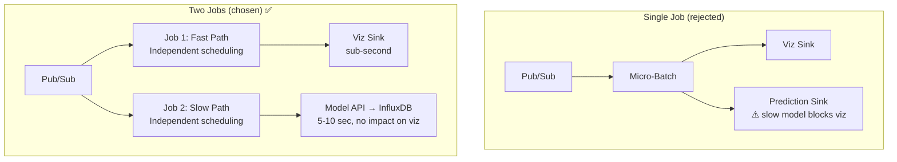

### 6. ML Component

Two distinct models serve different prediction scenarios:

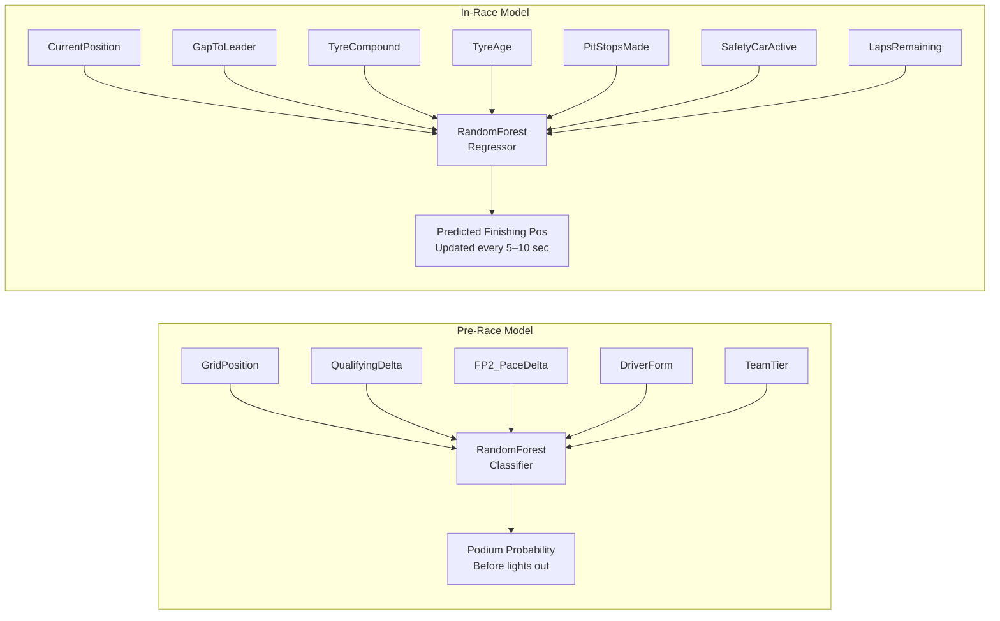

#### Pre-Race Model
- **Features:** GridPosition, TeamTier, QualifyingDelta, FP2_PaceDelta, DriverForm (from `DataCrawler.py` feature engineering).
- **Target:** Podium probability (binary: top 3 finish).
- **Training:** Spark Batch job, scikit-learn RandomForest.
- **Inference:** Run once per race as batch, results stored in PostgreSQL `prediction_accuracy`.
- **Purpose:** "Before the race starts, here's who we think will podium."

#### In-Race Model
- **Features:** CurrentPosition, GapToLeader, TyreCompound, TyreAge, PitStopsMade, SafetyCarActive, LapsRemaining.
- **Target:** Predicted finishing position.
- **Training:** Spark Batch job, trained on historical in-race snapshots (lap-by-lap state → final result).
- **Inference:** Model Serving API, called by Spark Streaming slow path every 5–10 seconds.
- **Purpose:** "Right now, lap 35, here's the predicted finishing order."

### 7. Visualization Layer

#### Streamlit App

- **Role:** User-facing dashboard. Reads from Cloud SQL PostgreSQL (historical), InfluxDB (live), and FastF1 cache (high-res telemetry).

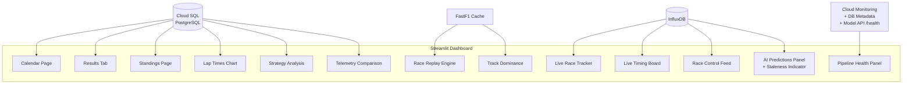

- **Data sources by view:**

  | View | Database | Query Method |
  |------|----------|-------------|
  | Calendar, event list | Cloud SQL PostgreSQL | `psycopg2` / SQLAlchemy |
  | Session results, standings | Cloud SQL PostgreSQL | SQL queries |
  | Lap time charts, strategy analysis | Cloud SQL PostgreSQL | SQL with GROUP BY |
  | Telemetry comparison | Cloud SQL PostgreSQL + FastF1 cache | SQL + fallback |
  | Race replay engine | FastF1 cache (requires 100ms interpolated X/Y) | Existing logic |
  | Track dominance, gear maps | FastF1 cache (per-meter Distance index) | Existing logic |
  | **Live race tracker** | InfluxDB `live_positions` | `influxdb-client` |
  | **Live timing board** | InfluxDB `live_timing` | `influxdb-client` |
  | **Race control feed** | InfluxDB `live_race_control` | `influxdb-client` |
  | **AI Predictions panel** | InfluxDB `predictions` | `influxdb-client` |
  | **Pipeline health** | Cloud Monitoring + DB metadata + Model API `/health` | REST API + queries |

- **Prediction Staleness Indicator:** Live predictions panel displays the timestamp of the last prediction update. If >15 seconds stale, show warning badge. Makes the fast/slow path latency tradeoff visible.

- **Pipeline Health Panel:**
  - Pub/Sub subscription backlog (via Cloud Monitoring API or `gcloud pubsub subscriptions describe`)
  - Last write timestamp per InfluxDB measurement and PostgreSQL table
  - Dataproc job status (Dataproc REST API or `gcloud dataproc jobs list`)
  - Model Serving API health, model version, inference latency (via `/health` endpoint)
  - Data quality summary (from PostgreSQL `data_quality` table)

- **High-Resolution Telemetry:** Race replay, track dominance, and gear maps require 100ms-interpolated X/Y coordinates and per-meter Distance indexing. This data is too granular for either database to serve efficiently. **Keep the existing FastF1 cache + Pandas in-memory approach.** The batch pipeline loads summary-level telemetry to PostgreSQL; full-resolution telemetry is served from cache.

- **Deployment:** Cloud Run (serverless container, scales to zero).

---

## GCP Infrastructure

### Project Resources

| Resource | GCP Service | Config | Purpose |
|----------|-------------|--------|---------|
| Pub/Sub Topics + Subscriptions | Cloud Pub/Sub | 3 topics, 6 subscriptions | Streaming message bus |
| Storage Buckets | Cloud Storage | Standard, `asia-southeast1` | Raw data, models, replay cache |
| PostgreSQL Instance | Cloud SQL | db-f1-micro (stop when idle) | Historical analytics serving DB |
| Virtual Machine | Compute Engine | e2-medium (2 vCPU, 4 GB) | Hosts InfluxDB + SimService + Model Serving API |
| Spark Clusters | Dataproc | Single-node n1-standard-4, auto-delete | Batch + 2× Streaming jobs |
| Streamlit Dashboard | Cloud Run | Serverless container | Dashboard (scales to zero) |

### Infrastructure Topology

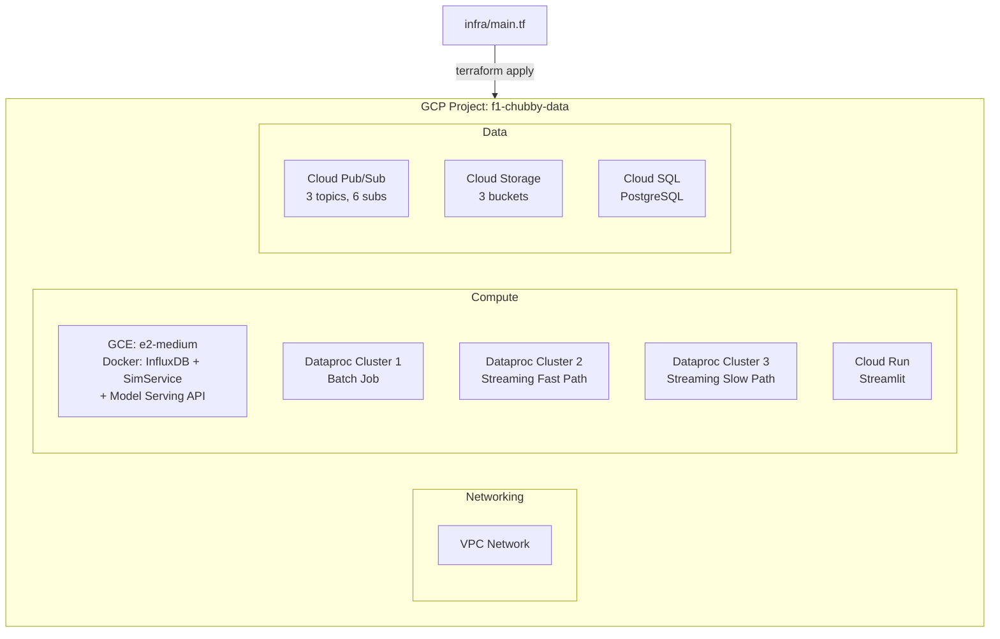

### Provisioning: Infrastructure as Code

All resources provisioned via **Terraform** (`infra/main.tf`):
- Makes teardown/re-creation trivial (`terraform destroy`)
- Enables reproducible setup across team members
- Demonstrates DevOps maturity (grading point)
- State stored in Terraform Cloud (free tier)
- Authentication via Workload Identity Federation (OIDC) — no stored secrets

### Estimated Cost (8 days: 7 dev + 1 demo)

| Component | Est. Cost |
|-----------|-----------|
| Cloud Pub/Sub (3 topics, demo volume) | ~$0.50 |
| Cloud Storage (~3–5 GB Standard) | ~$0.10 |
| Cloud SQL db-f1-micro (~4 days active, stopped otherwise) | ~$3 |
| Compute Engine e2-medium (8 days) | ~$6 |
| Dataproc single-node (~10 hrs compute total) | ~$3 |
| Cloud Run (Streamlit, low traffic) | ~$0.50 |
| **Total** | **~$13** |

> **$300 GCP free trial credits available.** Cost is essentially zero. Track usage anyway for the project report. Delete all resources after demo.

### Cost-Saving Practices

- **Stop Cloud SQL** when not actively developing (`gcloud sql instances patch <instance> --activation-policy NEVER`).
- **Stop the VM** when not developing (`gcloud compute instances stop`).
- **Auto-delete** Dataproc batch clusters after job completes (`--max-idle` flag for streaming clusters).
- **Cloud Run scales to zero** — no cost when not serving traffic.
- **Delete all resources** after the demo (`terraform destroy`).

---

## Message Schemas

Defined in `/schemas/` directory. All producers (Simulation Service) and consumers (Spark Streaming) reference these.

### `f1-telemetry` (per car, ~10 Hz)

```json
{
  "timestamp_ms": 1712345678900,
  "driver_id": "VER",
  "x": 1234.5,
  "y": 5678.9,
  "speed_kph": 312.4,
  "throttle_pct": 100.0,
  "brake_pct": 0.0,
  "gear": 8,
  "drs": 1,
  "lap_number": 15,
  "session_time_sec": 1845.3
}
```

### `f1-timing` (per car per lap)

```json
{
  "timestamp_ms": 1712345700000,
  "driver_id": "VER",
  "lap_number": 15,
  "position": 1,
  "lap_time_ms": 88234,
  "gap_to_leader_ms": 0,
  "interval_ms": 0,
  "tyre_compound": "MEDIUM",
  "tyre_age_laps": 8,
  "stint_number": 2,
  "pit_in_lap": false,
  "pit_out_lap": false
}
```

### `f1-race-control` (event-driven)

```json
{
  "timestamp_ms": 1712345750000,
  "flag": "YELLOW",
  "scope": "SECTOR_2",
  "message": "Yellow flag in sector 2",
  "driver_id": "HAM",
  "lap_number": 16
}
```

---

## Task Breakdown

### Phase Overview

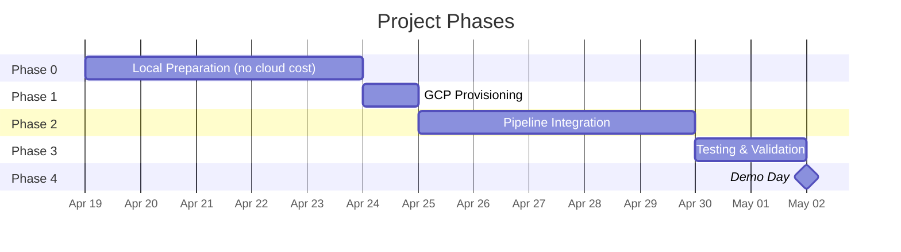

### Phase 0: Local Preparation (no cloud cost)

| # | Task | Depends On | Est. Effort |
|---|------|------------|-------------|
| 0.1 | Design Cloud SQL PostgreSQL schema (tables, columns, types, indexes, FK constraints) + InfluxDB measurements (4 live: tags, fields, timestamp semantics) | — | 4 hrs |
| 0.2 | Implement `MLCore.py`: pre-race model (podium classifier on DataCrawler features) + in-race model (position predictor on live features). Training + serialized prediction interface. | — | 5 hrs |
| 0.2b | Define Model Serving API contract (REST interface: POST /predict request/response schema, GET /health, error handling). Technology-agnostic. | 0.2 | 1 hr |
| 0.3 | Extend `DataCrawler.py`: add `google-cloud-storage` upload after extraction. Validate 2018–2025 coverage (telemetry from 2019+, results from 2018+). | — | 2 hrs |
| 0.4 | Build Simulation Service: read cached race from GCS → replay to Pub/Sub at configurable speed (using `google-cloud-pubsub` publisher) | — | 4 hrs |
| 0.4b | Define Pub/Sub message JSON schemas for all 3 topics (in `/schemas/` directory) | — | 1.5 hrs |
| 0.5 | Pre-cache 2–3 race replays as parquet (interpolated to 10 Hz unified timeline) | 0.4 | 1 hr |
| 0.6 | Dockerize InfluxDB + Simulation Service + Model Serving API (`docker-compose.yml` for local testing) | 0.1, 0.2b, 0.4 | 2.5 hrs |
| 0.7 | Dockerize Streamlit app | — | 1 hr |
| 0.8 | Write Terraform config (`infra/`) — all GCP resources parameterized, Terraform Cloud backend | — | 3 hrs |

**Phase 0 subtotal: ~25 hrs**

### Phase 1: GCP Infrastructure Provisioning

| # | Task | Depends On | Est. Effort |
|---|------|------------|-------------|
| 1.1 | Deploy Terraform (`terraform apply`), upload raw data + replay cache to GCS | 0.3, 0.5, 0.8 | 30 min |
| 1.2 | Verify Pub/Sub topics + subscriptions created by Terraform | 0.8 | 10 min |
| 1.3 | Verify Cloud SQL PostgreSQL instance, create tables + indexes from schema DDL | 0.1, 0.8 | 20 min |
| 1.4 | VM: verify Docker installed via startup script, deploy InfluxDB + Model Serving API containers, initialize InfluxDB buckets | 0.1, 0.2b, 0.8 | 30 min |
| 1.5 | Verify Cloud Run service + Dataproc API enabled | 0.8 | 10 min |

**Phase 1 subtotal: ~1.5 hrs**

### Phase 2: Pipeline Integration

| # | Task | Depends On | Est. Effort | Parallel Stream |
|---|------|------------|-------------|-----------------|
| 2.1 | Spark Batch job on Dataproc: GCS → data load + transform + feature engineering → Cloud SQL PostgreSQL (JDBC) + model artifacts → GCS | 1.1, 1.3, 1.5, 0.2 | 10 hrs | A |
| 2.2 | Deploy Model Serving API on VM, load pre-trained models, test /predict and /health endpoints | 1.4, 0.2b | 2 hrs | B |
| 2.3 | Spark Streaming fast path on Dataproc: Pub/Sub → parse/validate JSON → enrich metadata → InfluxDB live measurements | 1.2, 1.4, 1.5, 0.4b | 6 hrs | B |
| 2.4 | Spark Streaming slow path on Dataproc: Pub/Sub → windowed features → call Model Serving API → write predictions to InfluxDB | 1.2, 1.4, 1.5, 2.1, 2.2 | 7 hrs | B (after 2.1, 2.2) |
| 2.5 | Configure Simulation Service on VM to produce to Pub/Sub | 1.2, 1.4, 0.4 | 2 hrs | C |
| 2.6 | Streamlit: add live race panels (tracker, timing board, race control feed, AI predictions + staleness indicator) — InfluxDB | 0.1 | 5 hrs | C |
| 2.7 | Streamlit: add Cloud SQL PostgreSQL query layer for historical views (SQL queries alongside existing FastF1 cache logic) | 1.3, 2.1 | 4 hrs | A (after 2.1) |
| 2.8 | Streamlit: add pipeline health panel (Pub/Sub backlog, DB freshness, Dataproc job status, Model API /health, data quality) | 2.1, 2.2, 2.4 | 3 hrs | C (after 2.1, 2.2) |
| 2.9 | Deploy Streamlit app to Cloud Run | 2.6, 2.7, 2.8 | 1 hr | — |

**Phase 2 subtotal: ~40 hrs**

### Phase 3: End-to-End Testing & Validation

| # | Task | Depends On | Est. Effort |
|---|------|------------|-------------|
| 3.0 | Data quality validation: row-count checks per season per Cloud SQL PostgreSQL table, schema consistency, log to `data_quality` | 2.1 | 2 hrs |
| 3.1 | Run Spark Batch end-to-end, verify all historical data in Cloud SQL PostgreSQL, model artifacts in GCS | 2.1 | 1 hr |
| 3.2 | Start Simulation → verify events arrive in Pub/Sub (check Cloud Console metrics) | 2.5 | 30 min |
| 3.3 | Start fast-path streaming → verify live data in InfluxDB within 1 sec | 2.3, 3.2 | 1 hr |
| 3.4 | Start slow-path streaming → verify predictions in InfluxDB (independent of fast path) | 2.4, 3.2 | 1 hr |
| 3.5 | Open Streamlit → verify historical views from Cloud SQL PostgreSQL | 2.7, 3.1 | 30 min |
| 3.6 | Open Streamlit → verify live views update from fast path, predictions update independently from slow path | 3.3, 3.4 | 1 hr |
| 3.7 | **Kill slow-path job → confirm live visualization continues uninterrupted** *(key demo moment)* | 3.6 | 15 min |
| 3.8 | Verify pipeline health panel shows correct status for all components + Model API health | 2.8, 3.3, 3.4 | 30 min |
| 3.9 | Full dress rehearsal: complete demo flow at 5× speed | 3.0–3.8 | 2 hrs |

**Phase 3 subtotal: ~10 hrs**

### Phase 4: Demo Day

| # | Task | Depends On | Est. Effort |
|---|------|------------|-------------|
| 4.1 | Start VM (InfluxDB + Simulation Service + Model Serving API) + start Cloud SQL instance | 3.9 | 5 min |
| 4.2 | Submit both Dataproc Streaming jobs | 3.9 | 3 min |
| 4.3 | Verify Streamlit app is live on Cloud Run, pipeline health panel green | 3.9 | 2 min |
| 4.4 | Run demo: architecture walkthrough (~5 min) + live simulation (~15–18 min) | 4.1–4.3 | 25 min |
| 4.5 | **Tear down: `terraform destroy`** | 4.4 | 5 min |

---

## Total Estimated Effort

| Phase | Effort |
|-------|--------|
| Phase 0: Local Preparation | ~25 hrs |
| Phase 1: GCP Provisioning | ~1.5 hrs |
| Phase 2: Pipeline Integration | ~40 hrs |
| Phase 3: Testing & Validation | ~10 hrs |
| Phase 4: Demo Day | ~30 min |
| **Total** | **~77 person-hours** |

---

## Parallel Work Streams (2–3 team members)

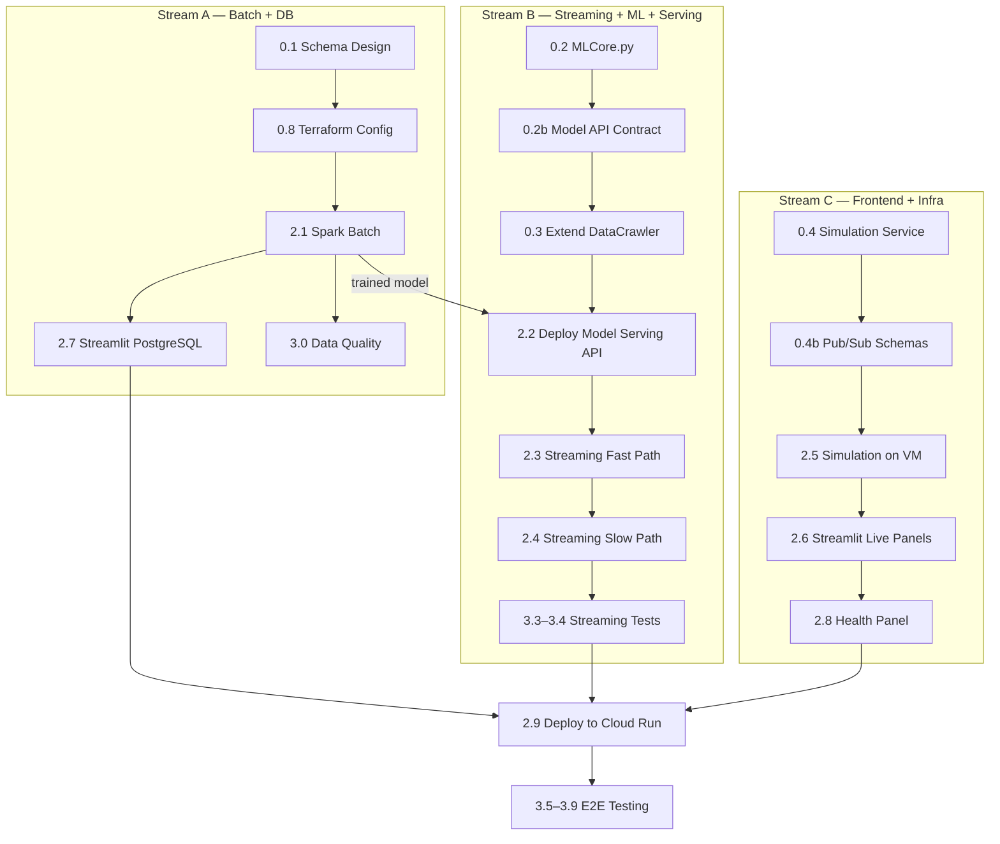

| Stream A (Batch + DB) | Stream B (Streaming + ML + Serving) | Stream C (Frontend + Infra) |
|------------------------|--------------------------------------|------------------------------|
| 0.1 Schema design | 0.2 MLCore.py | 0.4 Simulation Service |
| 0.8 Terraform config | 0.2b Model API contract | 0.4b Pub/Sub schemas |
| 2.1 Spark Batch | 2.2 Deploy Model Serving API | 2.5 Simulation on VM |
| 2.7 Streamlit PostgreSQL | 2.3 Streaming fast path | 2.6 Streamlit live panels |
| 3.0 Data quality | 2.4 Streaming slow path | 2.8 Health panel |
| | 3.3–3.4 Streaming tests | |

---

## Key Design Decisions

### 1. Dual-Database Serving Layer (PostgreSQL + InfluxDB)

Workload-driven database selection:
- **PostgreSQL** for historical data: the dashboard requires `GROUP BY (Driver, Stint, Compound)`, `ORDER BY Position`, JOINs, and window functions — all native SQL. FastF1's data model is fundamentally relational.
- **InfluxDB** for live streaming: append-heavy, time-indexed, short retention, no joins. Time-series DB is the right tool.
- Demonstrates understanding of database selection tradeoffs.

### 2. Decoupled Fast/Slow Streaming Paths

Two independent Spark Streaming jobs with **backpressure isolation**: if the prediction model is slow, Structured Streaming's micro-batch scheduling would delay the entire batch in a single-job design. Separate jobs have independent scheduling. The "kill slow path, fast path continues" test (Task 3.7) is a key demo moment.

### 3. Pragmatic Telemetry Strategy

Summary telemetry (sector speeds, top speeds) is batch-processed into PostgreSQL. Full-resolution telemetry (100ms X/Y interpolation for replay, per-meter Distance indexing for dominance maps) stays in FastF1 cache + Pandas in-memory. Neither PostgreSQL nor InfluxDB serves this data efficiently — and the existing implementation already works.

### 4. Two ML Models (Pre-Race + In-Race)

- **Pre-race**: Historical features → podium probability before lights out.
- **In-race**: Live features → predicted finishing position, updated lap-by-lap.
- Different feature sets, different inference timing, different serving paths. Architecturally clean.

### 5. DataCrawler as Ingestion Layer

Extended `DataCrawler.py` with GCS upload rather than a separate Ingestion Service. Same architectural role, less code to build and maintain. The diagram still shows a distinct ingestion layer.

### 6. Infrastructure as Code (Terraform)

All GCP resources provisioned via Terraform (`infra/main.tf`). State in Terraform Cloud (free tier). Auth via Workload Identity Federation (OIDC) — no stored secrets. Enables reproducible setup, easy teardown (`terraform destroy`), and demonstrates DevOps maturity.

### 7. Decoupled Model Serving API

ML inference abstracted behind a REST API (POST /predict, GET /health). Technology-agnostic contract — team chooses implementation later (MLflow, FastAPI+joblib, BentoML, or Vertex AI). Benefits:
- Spark Streaming slow path calls HTTP endpoint instead of loading models inline
- Models can be retrained and redeployed without restarting Spark jobs
- Health endpoint feeds pipeline monitoring
- Clean separation of concerns between data processing and ML

### 8. GCP over Azure

$300 free trial credits. Pub/Sub is a simpler message bus than Event Hubs (no capacity units). Dataproc is pure open-source Spark (no vendor lock-in like Databricks). Cloud Run scales to zero. Terraform is cloud-agnostic IaC (more widely used than Bicep).

---

## Fallback Plan (Demo Day)

| Failure Scenario | Mitigation |
|------------------|------------|
| Cloud SQL PostgreSQL down | Historical views fall back to FastF1 cache (existing code path still works) |
| Pub/Sub / Streaming down | Pre-recorded video of live panels + architecture walkthrough |
| Dataproc clusters fail to start | Show batch results already in Cloud SQL PostgreSQL + explain streaming design |
| Model Serving API down | Slow path writes "prediction unavailable" to InfluxDB; fast path + live viz unaffected |
| Worst case (all GCP down) | Full demo locally: Streamlit + FastF1 cache + architecture diagram |

---

## File Structure

```
F1-Chubby-Data/
├── Dashboard.py                 # Main Streamlit app (extend with PG + InfluxDB)
├── DataCrawler.py               # Extend with GCS upload
├── MLCore.py                    # NEW — Pre-race + in-race models
├── SimulationService.py         # NEW — Pub/Sub replay producer
├── docker-compose.yml           # NEW — InfluxDB + SimService + Model Serving API local dev
├── Dockerfile                   # NEW — Streamlit container
├── requirements.txt             # Updated with new dependencies
├── revised_plan.md              # This document
├── infra/
│   ├── main.tf                  # NEW — Terraform root module
│   ├── variables.tf             # NEW — Input variables
│   ├── outputs.tf               # NEW — Connection strings, URLs
│   ├── modules/
│   │   ├── networking/          # VPC, firewall rules
│   │   ├── pubsub/              # Topics, subscriptions
│   │   ├── storage/             # GCS buckets
│   │   ├── database/            # Cloud SQL instance
│   │   ├── compute/             # GCE VM
│   │   ├── dataproc/            # Cluster templates
│   │   └── cloudrun/            # Cloud Run service
│   └── terraform.tfvars         # Environment-specific values
├── model_serving/
│   ├── Dockerfile               # NEW — Model Serving API container
│   ├── app.py                   # NEW — REST API (POST /predict, GET /health)
│   └── models/                  # Serialized model artifacts (.joblib)
├── schemas/
│   ├── f1-telemetry.json        # NEW — Pub/Sub message schema
│   ├── f1-timing.json           # NEW — Pub/Sub message schema
│   └── f1-race-control.json     # NEW — Pub/Sub message schema
├── sql/
│   └── init.sql                 # NEW — PostgreSQL DDL (tables, indexes, FKs)
├── spark/
│   ├── batch_pipeline.py        # NEW — Spark Batch job
│   ├── streaming_fast.py        # NEW — Spark Streaming fast path
│   └── streaming_slow.py        # NEW — Spark Streaming slow path (calls Model API)
├── .github/
│   └── workflows/
│       ├── terraform.yml        # NEW — Terraform plan/apply via GitHub Actions
│       ├── deploy-streamlit.yml # NEW — Build + deploy to Cloud Run
│       ├── deploy-vm.yml        # NEW — Docker images → GCE
│       ├── deploy-dataproc.yml  # NEW — Submit Spark jobs
│       └── upload-data.yml      # NEW — GCS data upload
├── assets/
│   ├── Cars/
│   └── Teams/
└── f1_cache/                    # FastF1 local cache (gitignored)
```
