# F1-Chubby-Data: Revised System Architecture & Demo Plan

## Overview

A big-data pipeline for Formula 1 race analytics and real-time prediction, built as a Final Term Project demo. The system ingests historical and live (simulated) F1 data through a multi-layer architecture: ingestion, storage, batch/stream processing, and visualization — all running on Google Cloud Platform (GCP).

The serving layer uses **GCS + InfluxDB**: GCS (with on-demand download/upload caching via `GCStorage` in `core/data_loader.py`) for historical data, InfluxDB for time-series live streaming data. A **Model Serving API** provides a decoupled inference endpoint for real-time predictions. Two **lightweight Python Pub/Sub pull consumers** (fast path + slow path) run as Docker containers on the GCE VM, replacing the original Spark Structured Streaming design. During a live/simulated race, visualization of race data is **never blocked** by prediction — the two streaming paths are fully decoupled.

---

## Architecture

### High-Level Data Flow

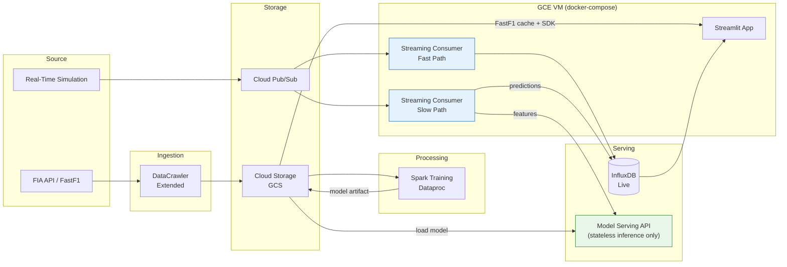

### Batch Processing Detail

A single Spark Dataproc job handles model training.

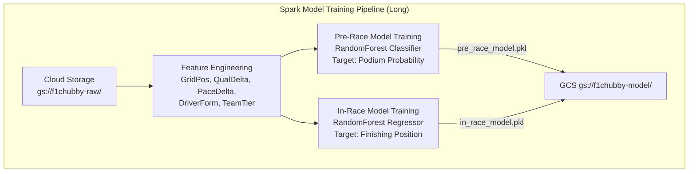

### Streaming Processing Detail

The streaming consumers are **lightweight Python processes** (not Spark Structured Streaming) that use the `google-cloud-pubsub` synchronous pull API. They run as Docker containers on the GCE VM alongside InfluxDB and the Model API.

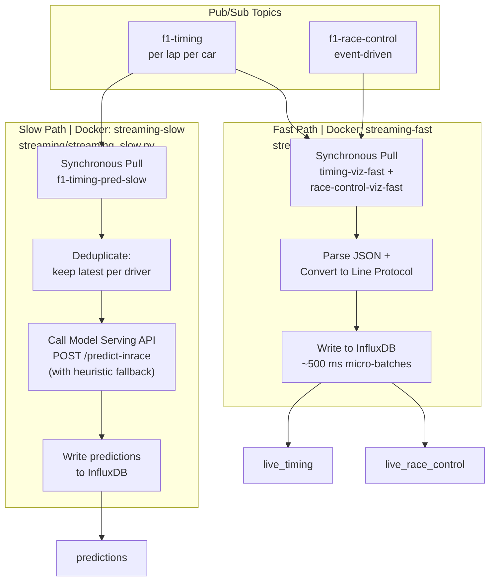

### Serving Strategy (GCS + InfluxDB)

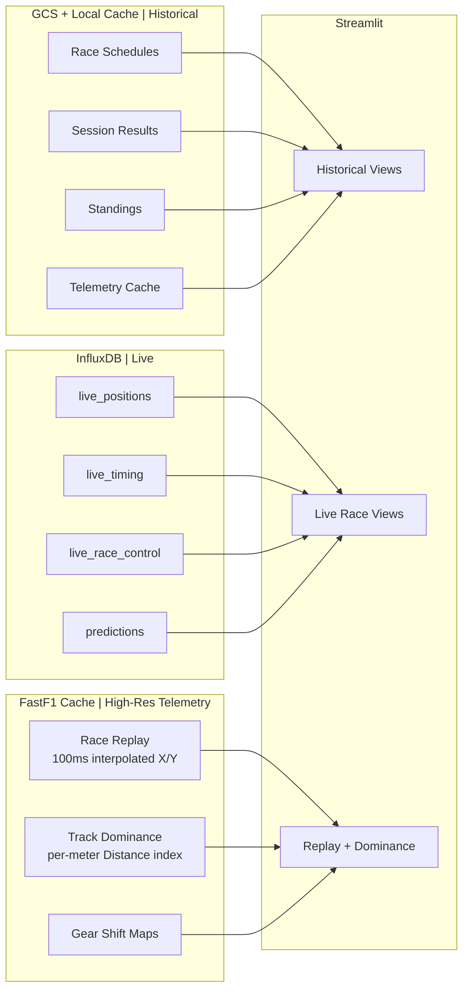

---

## Component Specification

### 1. Source Layer

#### FIA API (via FastF1)

- **Role:** Primary data source for historical F1 data.
- **Coverage:** 2019–2025 for telemetry-dependent features (telemetry quality degrades before 2019), 2018–2025 for results/standings.
- **Data includes:** Race calendars, session results, qualifying times, lap times, pit stops, driver/constructor standings, telemetry, race control messages.
- **Interaction:** Feeds into the DataCrawler (`FIA --> DC`).

#### Real-Time Simulation Service

- **Role:** Replays a pre-cached historical race into Pub/Sub, simulating a live race feed for demo day.
- **Why needed:** Cannot guarantee a real race on demo day.
- **Behavior:**
  - Reads pre-extracted telemetry for a historical race (stored as parquet/JSON in GCS under `replay-cache/`).
  - Publishes to three Pub/Sub topics at configurable speed (e.g., 5× → ~18 min race).
  - Produces directly to Pub/Sub (`SIM --> PUBSUB`), bypassing DataCrawler. This is intentional — during a real race the DataCrawler handles API data; during demo, the Simulation Service substitutes it.
- **Configuration:**
  - `REPLAY_SPEED` — Speed multiplier (default `5.0`).
  - `REPLAY_RACE` — Which cached race to replay (e.g., `2024_bahrain_R`).
- **Pre-caching:** A one-time script extracts a full race session from FastF1, interpolates all cars to a unified 10 Hz timeline, and uploads to GCS under `replay-cache/`.

### 2. Ingestion Layer

#### DataCrawler (Completed)

- **Role:** Served as the ingestion layer during development. Extracted data from the FIA API via FastF1, normalized it, saved locally, and uploaded raw data to Cloud Storage.
- **Current Status:** ✅ **Completed.** All historical data has been crawled and uploaded to GCS. The DataCrawler is no longer actively running but is kept in the architecture for documentation purposes.
- **Outputs:**
  - **To GCS** (`DC --> GCS`): Raw session data, partitioned as `gs://f1chubby-raw/{year}/{round}/{session}/`.
  - **To local CSV** (`f1_cache/historical_data_v2.csv`): ML training features.

### 3. Storage Layer

#### Cloud Storage (GCS)

- **Role:** Durable store for raw historical data, model artifacts, and replay cache.
- **Buckets:**
  - `f1chubby-raw/` — Raw session data and FastF1 cache, partitioned by `{year}/{round}/{session}/`. Also serves as the primary historical data source for the Streamlit dashboard (via `GCStorage` class in `core/data_loader.py` with bidirectional caching: downloads from GCS if available, falls back to FastF1, uploads new cache back to GCS, then cleans up the local copy).
  - `f1chubby-model/` — Trained model artifacts (`pre_race_model.pkl`, `in_race_model.pkl`).
- **Storage class:** Standard, single region (`asia-southeast1`).

#### Cloud Pub/Sub

- **Role:** Streaming message bus for live/simulated race data.
- **Topics:**
  - `f1-telemetry` — High-frequency car telemetry.
  - `f1-timing` — Per-lap timing data.
  - `f1-race-control` — Race director messages and flags.
- **Subscriptions (2 per consumed topic):**
  - `f1-timing-viz-fast` — Fast path consumer (timing data → InfluxDB).
  - `f1-race-control-viz-fast` — Fast path consumer (race control → InfluxDB).
  - `f1-timing-pred-slow` — Slow path consumer (timing data → Model API → InfluxDB predictions).
- **Message Schemas:** Defined as JSON Schema documents in `/schemas/` directory. All producers and consumers reference these schemas (see [Message Schemas](#message-schemas)).
- **Retention:** 1 day (sufficient for demo).
- **Why Pub/Sub over managed Kafka:** Native GCP, simpler setup (no namespace/TU config), automatic parallelism (no partition management), cheaper for demo volume. Trade-off: not Kafka API-compatible — producer/consumer code uses `google-cloud-pubsub` SDK instead of `kafka-python`.

### 4. Serving Layer

The serving layer combines GCS (with local disk cache) for historical data and InfluxDB for live streaming data.

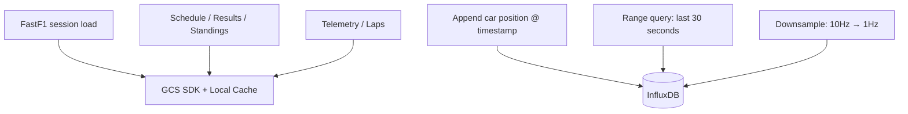

#### InfluxDB — Live Streaming Data

- **Role:** Serving database for live/simulated race data and real-time predictions.
- **Deployment:** InfluxDB 2.7 OSS in Docker on the GCE VM via docker-compose. Auto-initialized with org `f1chubby`, bucket `live_race`, admin token via env var.
- **Current Status:** ✅ Running as `f1-influxdb` container on VM (`<VM_IP>:8086`). Buckets populated by the streaming consumers (`streaming-fast` and `streaming-slow` containers).
- **Why InfluxDB for live data:** Append-heavy writes from streaming, time-indexed queries, short retention, no complex joins needed.

- **Measurements:**

  | Measurement | Source | Contents | Retention |
  |--------|--------|----------|----------|
  | `live_timing` | Streaming consumer (fast path) | Position, gap, interval, lap time, tyre compound/life, pit status — per lap per driver | 7 days |
  | `live_race_control` | Streaming consumer (fast path) | Flags, race director messages | 7 days |
  | `predictions` | Streaming consumer (slow path) | Win/podium probabilities per driver, with UTC timestamp | 7 days |

#### Model Serving API — Inference Endpoint

- **Role:** Stateless inference service that loads trained models and exposes a REST prediction endpoint. It receives features and returns predictions — it does **not** write to InfluxDB. The streaming slow-path consumer calls this API, receives predictions, and writes them to InfluxDB itself.
- **Deployment:** Containerized on the GCE VM (shared with InfluxDB + Streamlit) via docker-compose.
- **Technology:** FastAPI + joblib (implemented in `model_serving/app.py`). Downloads models from GCS bucket (`gs://f1chubby-model-<PROJECT_ID>/`) on startup, caches in a Docker named volume.
- **Current Status:** ✅ Running as `f1-model-api` container on VM. Models pulled from GCS on startup (3 artifacts: `podium_model.pkl`, `in_race_win_model.pkl`, `in_race_podium_model.pkl`). Endpoints: `POST /predict-inrace`, `POST /predict-prerace`, `GET /health`. Returns normalized probabilities.
- **Why decoupled serving:
  - Model can be **updated without restarting** the streaming consumers (hot-swap model versions).
  - Shows **separation of concerns** — feature computation (consumer) vs. model inference (API) are independent.
  - The serving layer is a standard production ML pattern (grading differentiator).
  - Adds a testable component with its own health check and latency metrics for the pipeline health panel.
- **Model loading:** Loads model artifacts from GCS (`gs://f1chubby-model/`) on startup and on-demand refresh.

- **Interface Contract:**

  ```
  POST /predict
  Content-Type: application/json

  Request:
  {
    "instances": [
      {
        "driver_id": "VER",
        "current_position": 3,
        "gap_to_leader_ms": 4521,
        "tyre_compound": "MEDIUM",
        "tyre_age_laps": 12,
        "pit_stops_made": 1,
        "safety_car_active": false,
        "laps_remaining": 22
      }
    ]
  }

  Response:
  {
    "predictions": [
      {"driver_id": "VER", "predicted_position": 2, "confidence": 0.78}
    ],
    "model_version": "in_race_v1",
    "inference_time_ms": 12
  }
  ```

  ```
  GET /health
  → 200 {"status": "healthy", "model_loaded": true, "model_version": "in_race_v1"}
  ```

  ```
  POST /predict-prerace
  Content-Type: application/json

  Request:
  {
    "year": 2024,
    "round": 1,
    "features": [
      {
        "driver": "VER",
        "GridPosition": 1,
        "TeamTier": 1,
        "QualifyingDelta": 0.0,
        "FP2_PaceDelta": 0.0,
        "DriverForm": 0.95
      }
    ]
  }

  Response:
  {
    "predictions": [
      {"driver": "VER", "podium_probability": 0.92}
    ],
    "model_version": "pre_race_v1",
    "inference_time_ms": 8
  }
  ```

- **Candidate Implementations (team decides):**

  | Option | Pros | Cons | Cost |
  |--------|------|------|------|
  | MLflow Model Serving | Industry-standard, model registry, versioning | Heavier dependency | $0 (on VM) |
  | FastAPI + joblib | Simple, full control, easy to debug | Manual model loading/versioning | $0 (on VM) |
  | BentoML | Built-in model packaging, OpenAPI docs | Less well-known | $0 (on VM) |
  | Vertex AI Endpoint | Fully managed, another GCP service | Adds cost, more setup | ~$2–5 |

### 5. Processing Layer

#### Spark Model Training

- **Role:** Reads raw historical data from GCS, engineers ML features, trains both models, and uploads serialized artifacts to GCS.
- **Jobs:**
  1. **Feature Engineering** — Compute features: grid position, qualifying delta, FP2/Sprint pace delta, driver form, team tier, tyre strategy metrics (pre-race); lap-by-lap state snapshots (in-race).
  2. **Pre-Race Model Training** — scikit-learn RandomForest classifier on engineered features. Save to GCS (`gs://f1chubby-model/pre_race_model.pkl`).
  3. **In-Race Model Training** — Trained on historical in-race snapshots (lap-by-lap state → final result). Save to GCS (`gs://f1chubby-model/in_race_model.pkl`).
- **Platform:** GCP Dataproc, single-node cluster (n1-standard-4), auto-delete after job completes.

#### Streaming Consumer — Fast Path

- **Role:** Consumes live/simulated timing and race control data from Pub/Sub and writes visualization data to InfluxDB with sub-second latency. **No model dependency.** Implemented as a lightweight Python pull consumer, not Spark Structured Streaming.
- **Implementation:** `streaming/streaming_fast.py` — a Python script using `google-cloud-pubsub` synchronous pull API.
- **Deployment:** Docker container (`streaming-fast`) on the GCE VM via `docker-compose`, co-located with InfluxDB.
- **Input:** `f1-timing-viz-fast` and `f1-race-control-viz-fast` Pub/Sub subscriptions.
- **Processing:** Pull messages → parse JSON → convert to InfluxDB line protocol (with tag escaping) → batch write.
- **Output:** InfluxDB `live_timing` and `live_race_control` measurements.
- **Cycle time:** ~500 ms pull-write loop.
- **Failure isolation:** If this consumer fails, only live visualization is affected. Predictions continue independently.

#### Streaming Consumer — Slow Path

- **Role:** Consumes timing data, deduplicates per driver (keeps latest lap), calls the Model Serving API for inference, and writes predictions to InfluxDB. Includes a heuristic fallback if the Model API is unreachable.
- **Implementation:** `streaming/streaming_slow.py` — a Python script using `google-cloud-pubsub` synchronous pull API + `requests` for HTTP calls.
- **Deployment:** Docker container (`streaming-slow`) on the GCE VM via `docker-compose`.
- **Input:** `f1-timing-pred-slow` Pub/Sub subscription.
- **Processing:** Pull timing messages → deduplicate (keep highest lap_number per driver) → build feature payload (`LapFraction`, `CurrentPosition`, `GapToLeader`, `TyreLife`, `CompoundIdx`, `IsPitOut`) → `POST /predict-inrace` → write `predictions` to InfluxDB.
- **Heuristic fallback:** If Model API returns non-200, compute position-based heuristic probabilities (exponential decay from position) with normalization.
- **Output:** InfluxDB `predictions` measurement with `win_prob`, `podium_prob`, `lap_number` per driver.
- **Cycle time:** ~10 second pull-predict-write loop.
- **Failure isolation:** If prediction lags or crashes, live visualization is completely unaffected.

##### Why Two Separate Streaming Consumers

Full **failure isolation**. Each consumer is an independent Docker container with its own pull loop. If the slow-path prediction consumer crashes or lags (e.g., Model API timeout), the fast-path visualization consumer is completely unaffected — it keeps writing live timing and race control data to InfluxDB at sub-second intervals. The "kill slow path, fast path continues" test (Task 3.7) is a key demo moment.

##### Why Python Pull Consumers Instead of Spark Structured Streaming

The original design used Spark Structured Streaming on Dataproc for both paths. This was replaced with lightweight Python Pub/Sub pull consumers for several reasons:

- **Simpler deployment:** Containers on the existing VM vs. managing 2 dedicated Dataproc clusters.
- **Lower cost:** Eliminates ~$3 in Dataproc compute costs (2 single-node clusters × ~5 hrs each).
- **Lower latency:** Direct pull → write with no Spark micro-batch overhead. The fast path achieves ~500 ms cycles.
- **Easier debugging:** Plain Python scripts with standard logging vs. Spark executor logs across a cluster.
- **Co-location:** Running on the same VM as InfluxDB eliminates network latency for writes.
- **Sufficient for demo scale:** With 20 cars × 1 message/lap, the throughput requirement is trivially low — no distributed processing needed.
- **Trade-off:** Not horizontally scalable. For production F1 telemetry at 10 Hz × 20 cars, Spark or a distributed consumer would be needed. For a demo with simulated replay data, a single Python process per path is more than adequate.

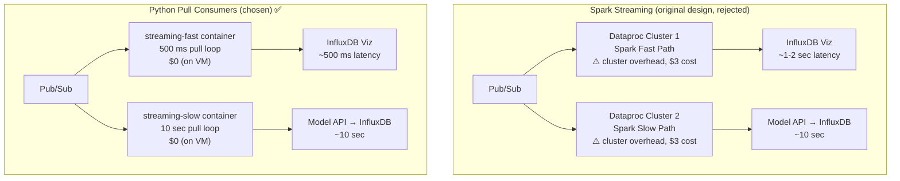

### 6. ML Component

Two distinct models serve different prediction scenarios:

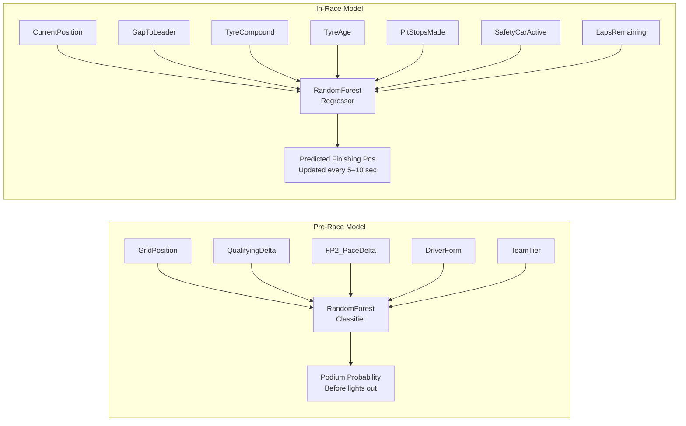

#### Pre-Race Model
- **Features:** GridPosition, TeamTier, QualifyingDelta, FP2_PaceDelta, DriverForm (from `DataCrawler.py` feature engineering).
- **Target:** Podium probability (binary: top 3 finish).
- **Training:** Spark Batch job, scikit-learn RandomForest.
- **Inference:** Model Serving API `POST /predict-prerace`, called by the Streamlit dashboard when user clicks "Generate Predictions".
- **Purpose:** "Before the race starts, here's who we think will podium."

#### In-Race Model
- **Features:** CurrentPosition, GapToLeader, TyreCompound, TyreAge, PitStopsMade, SafetyCarActive, LapsRemaining.
- **Target:** Predicted finishing position.
- **Training:** Spark Batch job, trained on historical in-race snapshots (lap-by-lap state → final result).
- **Inference:** Model Serving API, called by the streaming slow-path consumer every ~10 seconds.
- **Purpose:** "Right now, lap 35, here's the predicted finishing order."

### 7. Visualization Layer

#### Streamlit App

- **Role:** User-facing dashboard. Reads from GCS bucket (via FastF1 SDK with local disk cache) for historical data, InfluxDB for live race data, and FastF1 cache for high-res telemetry.

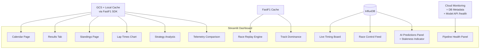

- **Data sources by view:**

  | View | Data Source | Query Method |
  |------|------------|-------------|
  | Calendar, event list | GCS + FastF1 cache | `fastf1.get_event_schedule()` |
  | Session results, standings | GCS + FastF1 cache | `fastf1.get_session()` via GCS-backed cache |
  | Lap time charts, strategy analysis | GCS + FastF1 cache | FastF1 session laps |
  | Telemetry comparison | GCS + FastF1 cache | FastF1 session telemetry |
  | Race replay engine | FastF1 cache (requires 100ms interpolated X/Y) | Existing logic |
  | Track dominance, gear maps | FastF1 cache (per-meter Distance index) | Existing logic |
  | **Live timing board** | InfluxDB `live_timing` | `influxdb-client` |
  | **Race control feed** | InfluxDB `live_race_control` | `influxdb-client` |
  | **AI Predictions panel** | InfluxDB `predictions` | `influxdb-client` |
  | **Pipeline health** | Cloud Monitoring + InfluxDB metadata + Model API `/health` | REST API + queries |

- **Prediction Staleness Indicator:** Live predictions panel displays the timestamp of the last prediction update. If >15 seconds stale, show warning badge. Makes the fast/slow path latency tradeoff visible.

- **Pipeline Health Panel:**
  - Pub/Sub subscription backlog (via Cloud Monitoring API or `gcloud pubsub subscriptions describe`)
  - Last write timestamp per InfluxDB measurement
  - Streaming consumer container health (via `docker inspect` or healthcheck)
  - Model Serving API health, model version, inference latency (via `/health` endpoint)

- **High-Resolution Telemetry:** Race replay, track dominance, and gear maps require 100ms-interpolated X/Y coordinates and per-meter Distance indexing. This data is too granular for InfluxDB to serve efficiently. **Keep the existing FastF1 cache + Pandas in-memory approach.** Full-resolution telemetry is served from the GCS-backed local cache.

- **Deployment:** Docker container on the GCE VM via `docker-compose`, co-located with InfluxDB, streaming consumers, and Model Serving API. Accessible at `https://f1.thedblaster.id.vn` via Cloudflare (SSL Flexible, proxied A record → `<VM_IP>`). Port mapping: host 80 → container 8501. The container mounts `./f1_cache:/app/f1_cache` but the directory starts empty on the VM — `GCStorage` in `core/data_loader.py` downloads session cache from GCS on-demand and cleans up after each load. The deploy-vm CI workflow intentionally does **not** copy `f1_cache` to the VM, keeping deployments fast and lightweight. The Streamlit container uses a separate `requirements-streamlit.txt` (excludes `scikit-learn`/`joblib`) for a lighter image — all ML inference is handled by the Model Serving API, not inline. GCS access uses Application Default Credentials (ADC) via the VM's service account.
- **Current Status:** ✅ Live at `https://f1.thedblaster.id.vn`. Home page, drivers standings, constructors standings, and race details pages serve data from GCS via FastF1 cache (with Ergast API fallback for standings). Pre-race and in-race predictions route through the Model Serving API.

- **ML Decoupling:**
  - **In-race predictions:** The Streamlit app reads predictions from InfluxDB `predictions` measurement (written by the streaming slow-path consumer via the Model Serving API). It does **not** import `ml_core.py` or load `.pkl` files. A staleness indicator shows when predictions are stale (>15s yellow, >30s red).
  - **Pre-race predictions:** The Streamlit app sends features to the Model Serving API via `POST /predict-prerace` and displays the returned probabilities. The interactive "Generate Predictions" button is preserved.
  - **Local development mode:** GCS access uses Application Default Credentials. Developers run `gcloud auth application-default login` locally. The `GCS_BUCKET` env var (default: `f1chubby-raw`) is configurable via docker-compose.

---

## GCP Infrastructure

### Project Resources

| Resource | GCP Service | Config | Purpose |
|----------|-------------|--------|---------|
| Pub/Sub Topics + Subscriptions | Cloud Pub/Sub | 2 topics, 3 subscriptions | Streaming message bus |
| Storage Buckets | Cloud Storage | Standard, `asia-southeast1` | Raw data + FastF1 cache, model artifacts |
| Virtual Machine | Compute Engine | e2-medium (2 vCPU, 4 GB), static IP `<VM_IP>` | Hosts InfluxDB + Streaming Consumers + Model Serving API + Streamlit (docker-compose, 5 containers) |
| Spark Clusters | Dataproc | Single-node n1-standard-4, auto-delete | Model training job only (streaming moved to VM) |

### Infrastructure Topology

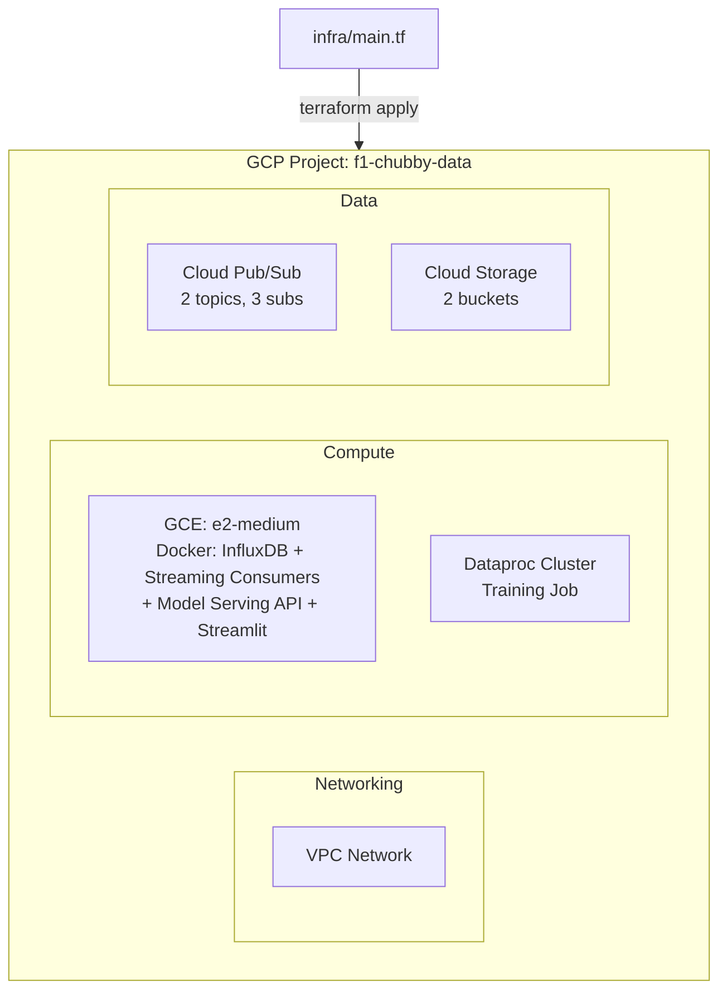

### Provisioning: Infrastructure as Code

All resources provisioned via **Terraform** (`infra/main.tf`):
- Makes teardown/re-creation trivial (`terraform destroy`)
- Enables reproducible setup across team members
- Demonstrates DevOps maturity (grading point)
- State stored in Terraform Cloud (free tier)
- Authentication via Workload Identity Federation (OIDC) — no stored secrets

### Estimated Cost (8 days: 7 dev + 1 demo)

| Component | Est. Cost |
|-----------|-----------|
| Cloud Pub/Sub (2 topics, demo volume) | ~$0.50 |
| Cloud Storage (~3–5 GB Standard) | ~$0.10 |
| Compute Engine e2-medium (8 days) | ~$6 |
| Dataproc single-node (~2 hrs compute total, training only) | ~$0.75 |
| **Total** | **~$7.35** |

> **$300 GCP free trial credits available.** Cost is essentially zero. Track usage anyway for the project report. Delete all resources after demo.

### Cost-Saving Practices

- **Stop the VM** when not developing (`gcloud compute instances stop`).
- **Auto-delete** Dataproc batch clusters after job completes.
- **Delete all resources** after the demo (`terraform destroy`).

---

## Message Schemas

Defined in `/schemas/` directory. All producers (Simulation Service) and consumers (streaming containers) reference these.

### `f1-telemetry` (per car, ~10 Hz)

```json
{
  "timestamp_ms": 1712345678900,
  "driver_id": "VER",
  "x": 1234.5,
  "y": 5678.9,
  "speed_kph": 312.4,
  "throttle_pct": 100.0,
  "brake_pct": 0.0,
  "gear": 8,
  "drs": 1,
  "lap_number": 15,
  "session_time_sec": 1845.3
}
```

### `f1-timing` (per car per lap)

```json
{
  "timestamp_ms": 1712345700000,
  "driver_id": "VER",
  "lap_number": 15,
  "position": 1,
  "lap_time_ms": 88234,
  "gap_to_leader_ms": 0,
  "interval_ms": 0,
  "tyre_compound": "MEDIUM",
  "tyre_age_laps": 8,
  "stint_number": 2,
  "pit_in_lap": false,
  "pit_out_lap": false
}
```

### `f1-race-control` (event-driven)

```json
{
  "timestamp_ms": 1712345750000,
  "flag": "YELLOW",
  "scope": "SECTOR_2",
  "message": "Yellow flag in sector 2",
  "driver_id": "HAM",
  "lap_number": 16
}
```

---

## Task Breakdown

### Phase Overview

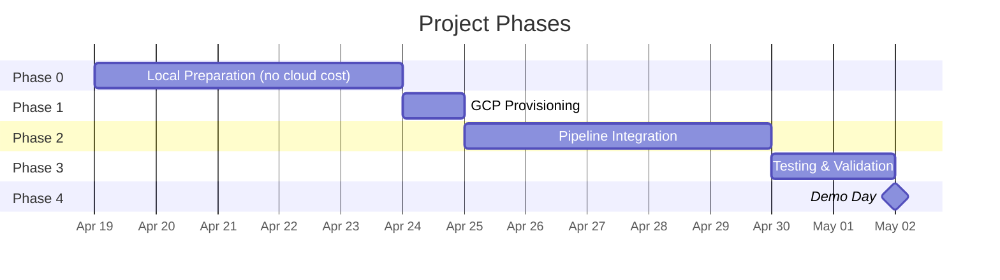

### Phase 0: Local Preparation (no cloud cost)

| # | Task | Depends On | Est. Effort |
|---|------|------------|-------------|
| 0.1 | Design InfluxDB measurements (3 live: tags, fields, timestamp semantics) | — | 2 hrs |
| 0.2 | Implement `MLCore.py`: pre-race model (podium classifier on DataCrawler features) + in-race model (position predictor on live features). Training + serialized prediction interface. | — | 5 hrs |
| 0.2b | Define Model Serving API contract (REST interface: POST /predict for in-race, POST /predict-prerace for pre-race, GET /health, error handling). Technology-agnostic. | 0.2 | 1 hr |
| 0.3 | Extend `DataCrawler.py`: add `google-cloud-storage` upload after extraction. Validate 2018–2025 coverage (telemetry from 2019+, results from 2018+). | — | 2 hrs |
| 0.4 | Build Simulation Service: read cached race from GCS → replay to Pub/Sub at configurable speed (using `google-cloud-pubsub` publisher) | — | 4 hrs |
| 0.4b | Define Pub/Sub message JSON schemas for all 3 topics (in `/schemas/` directory) | — | 1.5 hrs |
| 0.5 | Pre-cache 2–3 race replays as parquet (interpolated to 10 Hz unified timeline) | 0.4 | 1 hr |
| 0.6 | Dockerize InfluxDB + Simulation Service + Model Serving API + Streamlit (`docker-compose.yml` for local testing + VM deployment) | 0.1, 0.2b, 0.4 | 2.5 hrs |
| 0.7 | Dockerize Streamlit app for VM deployment (use `requirements-streamlit.txt`, mount FastF1 cache volume) | — | 1 hr |
| 0.8 | Write Terraform config (`infra/`) — all GCP resources parameterized, Terraform Cloud backend | — | 3 hrs |

**Phase 0 subtotal: ~23 hrs**

### Phase 1: GCP Infrastructure Provisioning

| # | Task | Depends On | Est. Effort |
|---|------|------------|-------------|
| 1.1 | Deploy Terraform (`terraform apply`), upload raw data + replay cache to GCS | 0.3, 0.5, 0.8 | 30 min |
| 1.2 | Verify Pub/Sub topics + subscriptions created by Terraform | 0.8 | 10 min |
| 1.4 | VM: verify Docker installed via startup script, deploy InfluxDB + Model Serving API + Streamlit containers, initialize InfluxDB buckets | 0.1, 0.2b, 0.8 | 30 min |
| 1.5 | Verify Dataproc API enabled, Streamlit accessible on VM port 8501 | 0.8 | 10 min |

**Phase 1 subtotal: ~1.5 hrs**

### Phase 2: Pipeline Integration

| # | Task | Depends On | Est. Effort | Parallel Stream |
|---|------|------------|-------------|-----------------|
| 2.1b | Spark Model Training on Dataproc: GCS → feature engineering → train pre-race + in-race models → `.pkl` → GCS | 1.1, 1.5 | 5 hrs | A |
| 2.2 | Deploy Model Serving API on VM, load pre-trained models, test /predict and /health endpoints | 1.4, 0.2b | 2 hrs | B |
| 2.3 | Streaming fast-path consumer on VM: Pub/Sub pull → parse JSON → InfluxDB line protocol → write live measurements | 1.2, 1.4, 0.4b | 3 hrs | B |
| 2.4 | Streaming slow-path consumer on VM: Pub/Sub pull → deduplicate → call Model Serving API → write predictions to InfluxDB | 1.2, 1.4, 2.1b, 2.2 | 4 hrs | B (after 2.1b, 2.2) |
| 2.5 | Configure Simulation Service on VM to produce to Pub/Sub | 1.2, 1.4, 0.4 | 2 hrs | C |
| 2.6 | Streamlit: add live race panels (timing board, race control feed, AI predictions + staleness indicator) — reads from InfluxDB, no inline ML inference | 0.1 | 5 hrs | C |
| 2.8 | Streamlit: add pipeline health panel (Pub/Sub backlog, DB freshness, streaming container health, Model API /health) | 2.2, 2.4 | 3 hrs | C (after 2.2) |
| 2.9 | Deploy Streamlit app on VM via docker-compose (mount FastF1 cache, configure env vars for InfluxDB/Model API) | 2.6, 2.8 | 1 hr | — |

**Phase 2 subtotal: ~25 hrs**

### Phase 3: End-to-End Testing & Validation

| # | Task | Depends On | Est. Effort |
|---|------|------------|-------------|
| 3.0 | Verify model artifacts in GCS after training job completes | 2.1b | 30 min |
| 3.1 | Run Spark Training end-to-end, verify model artifacts in GCS | 2.1b | 1 hr |
| 3.2 | Start Simulation → verify events arrive in Pub/Sub (check Cloud Console metrics) | 2.5 | 30 min |
| 3.3 | Start fast-path consumer → verify live data in InfluxDB within 1 sec | 2.3, 3.2 | 1 hr |
| 3.4 | Start slow-path consumer → verify predictions in InfluxDB (independent of fast path) | 2.4, 3.2 | 1 hr |
| 3.5 | Open Streamlit → verify historical views from GCS + FastF1 cache | 3.1 | 30 min |
| 3.6 | Open Streamlit → verify live views update from fast path, predictions update independently from slow path | 3.3, 3.4 | 1 hr |
| 3.7 | **Kill slow-path consumer → confirm live visualization continues uninterrupted** *(key demo moment)* | 3.6 | 15 min |
| 3.8 | Verify pipeline health panel shows correct status for all components + Model API health + streaming container status | 2.8, 3.3, 3.4 | 30 min |
| 3.9 | Full dress rehearsal: complete demo flow at 5× speed | 3.0–3.8 | 2 hrs |

**Phase 3 subtotal: ~8 hrs**

### Phase 4: Demo Day

| # | Task | Depends On | Est. Effort |
|---|------|------------|-------------|
| 4.1 | Start VM (InfluxDB + Streaming Consumers + Simulation Service + Model Serving API + Streamlit) | 3.9 | 5 min |
| 4.2 | Verify all 5 containers running, pipeline health panel green | 3.9 | 2 min |
| 4.3 | Verify Streamlit app is live on VM, pipeline health panel green | 3.9 | 2 min |
| 4.4 | Run demo: architecture walkthrough (~5 min) + live simulation (~15–18 min) | 4.1–4.3 | 25 min |
| 4.5 | **Tear down: `terraform destroy`** | 4.4 | 5 min |

---

## Total Estimated Effort

| Phase | Effort |
|-------|--------|
| Phase 0: Local Preparation | ~23 hrs |
| Phase 1: GCP Provisioning | ~1.5 hrs |
| Phase 2: Pipeline Integration | ~25 hrs |
| Phase 3: Testing & Validation | ~8 hrs |
| Phase 4: Demo Day | ~30 min |
| **Total** | **~58 person-hours** |

---

## Parallel Work Streams (4 team members)

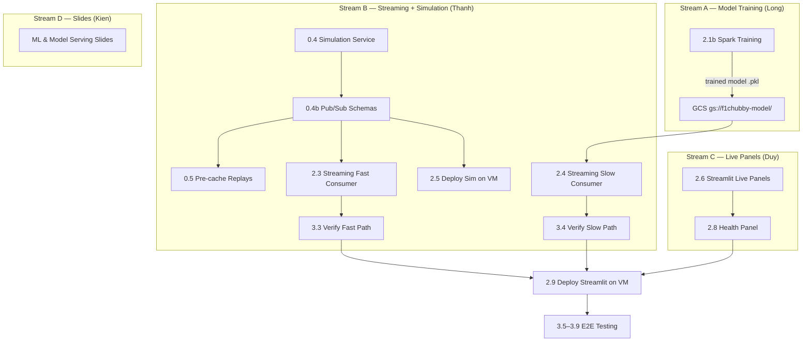

| Stream A — Training (Long) | Stream B — Streaming (Thanh) | Stream C — Live Panels (Duy) | Stream D (Kien) |
|---------------------------|-------------------------------|-------------------------------|-----------------|
| 2.1b Spark Training | 0.4 Simulation Service | 2.6 Streamlit live panels | Slides |
| | 0.4b Pub/Sub schemas | 2.8 Health panel | |
| | 0.5 Pre-cache replays | | |
| | 2.3 Streaming fast consumer | | |
| | 2.4 Streaming slow consumer | | |
| | 2.5 Deploy sim on VM | | |

---

## Key Design Decisions

### 1. GCS + InfluxDB Serving Layer

Workload-driven data source selection:
- **GCS (via FastF1 SDK with local disk cache)** for historical data: session data is downloaded from GCS on first access and cached locally in `f1_cache/`. FastF1 handles session loading, telemetry, laps natively. GCS provides durability while FastF1's built-in caching keeps the dashboard fast.
- **InfluxDB** for live streaming: append-heavy, time-indexed, short retention, no joins. Time-series DB is the right tool.
- Demonstrates understanding of storage selection tradeoffs.

### 2. Decoupled Fast/Slow Streaming Consumers

Two independent Python Pub/Sub pull consumers run as separate Docker containers with **failure isolation**: if the slow-path prediction consumer crashes or the Model API is slow, the fast-path visualization consumer continues writing live timing data to InfluxDB without interruption. The "kill slow path, fast path continues" test (Task 3.7) is a key demo moment.

### 3. Pragmatic Telemetry Strategy

Full-resolution telemetry (100ms X/Y interpolation for replay, per-meter Distance indexing for dominance maps) stays in FastF1 cache + Pandas in-memory, backed by GCS. InfluxDB is not suitable for this data — and the existing implementation already works.

### 4. Two ML Models (Pre-Race + In-Race)

- **Pre-race**: Historical features → podium probability before lights out.
- **In-race**: Live features → predicted finishing position, updated lap-by-lap.
- Different feature sets, different inference timing, different serving paths. Architecturally clean.

### 5. DataCrawler as Ingestion Layer (Completed)

Used `DataCrawler.py` with GCS upload to crawl all historical F1 data. All data is now in GCS. The DataCrawler is no longer actively running but remains in the architecture for documentation and demonstration purposes.

### 6. Infrastructure as Code (Terraform)

All GCP resources provisioned via Terraform (`infra/main.tf`). State in Terraform Cloud (free tier). Auth via Workload Identity Federation (OIDC) — no stored secrets. Enables reproducible setup, easy teardown (`terraform destroy`), and demonstrates DevOps maturity.

### 7. Decoupled Model Serving API

ML inference abstracted behind a REST API (POST /predict, GET /health). Technology-agnostic contract — team chooses implementation later (MLflow, FastAPI+joblib, BentoML, or Vertex AI). Benefits:
- Streaming slow-path consumer calls HTTP endpoint instead of loading models inline
- Models can be retrained and redeployed without restarting Spark jobs
- Health endpoint feeds pipeline monitoring
- Clean separation of concerns between data processing and ML

### 8. GCP over Azure

$300 free trial credits. Pub/Sub is a simpler message bus than Event Hubs (no capacity units). Dataproc is pure open-source Spark (no vendor lock-in like Databricks). Terraform is cloud-agnostic IaC (more widely used than Bicep).

### 9. Python Pull Consumers over Spark Structured Streaming

The streaming consumers were migrated from Spark Structured Streaming (Dataproc) to lightweight Python Pub/Sub pull consumers (Docker on VM). Key reasons:
- **Right-sizing:** Demo throughput (~20 messages/lap × 60 laps = ~1,200 messages/race) is trivially low for distributed processing. A single Python process handles it with negligible CPU.
- **Operational simplicity:** No Dataproc cluster management, no Spark UI, no executor logs. Plain Python with standard logging.
- **Cost savings:** Eliminates 2 Dataproc clusters (~$3 compute cost), streaming runs at $0 incremental on the existing VM.
- **Lower latency:** Direct Pub/Sub SDK pull → InfluxDB write, no Spark micro-batch scheduling overhead.
- **Co-location:** Same Docker network as InfluxDB and Model API — no cross-network hops.
- **The `spark/` copies remain** for potential Dataproc submission (e.g., if scaling is needed), but primary deployment is Docker on VM.

### 10. Spark Model Training Pipeline

The Spark Model Training job (task 2.1b) reads raw historical data from GCS, engineers features, trains both pre-race and in-race models, and uploads serialized artifacts to GCS. Runs on a single-node Dataproc cluster that auto-deletes after the job completes. Owned by Long.

### 11. Streamlit on VM (not Cloud Run)

The Streamlit dashboard runs as a Docker container on the GCE VM via `docker-compose`, co-located with InfluxDB, streaming consumers, and Model Serving API. Rationale:
- **Persistent FastF1 cache:** High-resolution telemetry (replay, track dominance, gear maps) requires ~2–5 GB of FastF1 cache on disk. Cloud Run containers are ephemeral — the cache would need to be re-downloaded on every cold start or baked into the image (bloating it to 5–10 GB).
- **Co-location with InfluxDB:** Live race views query InfluxDB at sub-second intervals. Running on the same VM eliminates network latency for these queries.
- **No cold start:** Cloud Run scales to zero, meaning the first request after idle incurs a cold start (loading FastF1 cache + large dependencies). On the VM, the container is always warm.
- **Cost neutral:** The VM is already running 24/7 for InfluxDB. Adding Streamlit costs $0 incremental.
- **ML decoupling:** The Streamlit container does **not** import `ml_core.py` or load `.pkl` model files. In-race predictions are read from InfluxDB (written by the streaming slow path). Pre-race predictions are fetched via HTTP from the Model Serving API (`POST /predict-prerace`). This uses a separate `requirements-streamlit.txt` without `scikit-learn`/`joblib` for a lighter image.
- **Trade-off:** No auto-scaling. For a demo with 1–2 concurrent users, this is acceptable.

---

## Fallback Plan (Demo Day)

| Failure Scenario | Mitigation |
|------------------|------------|
| Pub/Sub / Streaming down | Streaming consumers auto-restart via `docker-compose restart: unless-stopped`. If Pub/Sub is down: pre-recorded video of live panels + architecture walkthrough |
| Dataproc training fails | Models already in GCS from previous run; Model Serving API continues serving. Explain training design in walkthrough |
| Model Serving API down | Slow-path consumer falls back to heuristic predictions (position-based exponential decay); fast path + live viz unaffected. Pre-race predictions show "unavailable" in UI |
| VM down (all services) | Restart VM; all containers auto-restart via docker-compose `restart: unless-stopped`. FastF1 cache persists on disk. Streaming consumers reconnect to Pub/Sub automatically. If unrecoverable: demo with architecture diagrams + pre-recorded video |

---

## File Structure

```
F1-Chubby-Data/
├── Dashboard.py                 # Main Streamlit app (extend with InfluxDB)
├── DataCrawler.py               # Extend with GCS upload
├── MLCore.py                    # NEW — Pre-race + in-race models (training only)
├── SimulationService.py         # NEW — Pub/Sub replay producer
├── docker-compose.yml           # InfluxDB + Streaming Consumers + Model Serving API + Streamlit (5 services)
├── Dockerfile                   # Streamlit container (uses requirements-streamlit.txt, port 8501)
├── requirements.txt             # Full dependencies (batch/training)
├── requirements-streamlit.txt   # Streamlit-only deps (no scikit-learn/joblib)
├── .env.example                 # Template: InfluxDB, GCS env vars
├── revised_plan.md              # This document
├── infra/
│   ├── main.tf                  # Terraform root module
│   ├── variables.tf             # Input variables
│   ├── outputs.tf               # Connection strings, VM IP
│   ├── modules/
│   │   ├── networking/          # VPC, firewall rules (incl. port 80 for Streamlit, 8080, 8086, SSH)
│   │   ├── pubsub/              # Topics, subscriptions
│   │   ├── storage/             # GCS buckets
│   │   ├── compute/             # GCE VM
│   │   ├── dataproc/            # Cluster templates
│   │   └── cloudrun/            # Artifact Registry repo (Cloud Run removed, kept for registry)
│   └── terraform.tfvars         # Environment-specific values
├── model_serving/
│   ├── Dockerfile               # Model Serving API container (python:3.11-slim + FastAPI + scikit-learn)
│   ├── app.py                   # FastAPI REST API (POST /predict-inrace, POST /predict-prerace, GET /health)
│   ├── requirements.txt         # ML deps: fastapi, scikit-learn, joblib, google-cloud-storage
│   └── models/                  # Placeholder dir — models downloaded from GCS on startup
├── schemas/
│   ├── f1-telemetry.json        # Pub/Sub message schema
│   ├── f1-timing.json           # Pub/Sub message schema
│   └── f1-race-control.json     # Pub/Sub message schema
├── scripts/
│   └── simulate_race_to_influxdb.py  # Simulation service script
├── core/
│   ├── data_loader.py           # Data sources: GCS + FastF1 cache
│   └── ...
├── spark/
│   ├── training_pipeline.py     # Spark Model Training job (GCS → features → train → .pkl → GCS)
│   ├── streaming_fast.py        # Copy of fast-path consumer (for Dataproc if needed)
│   └── streaming_slow.py        # Copy of slow-path consumer (for Dataproc if needed)
├── streaming/
│   ├── Dockerfile               # Lightweight Python container (pubsub + influxdb-client + requests)
│   ├── streaming_fast.py        # Fast-path consumer: Pub/Sub pull → InfluxDB (~500 ms cycle)
│   └── streaming_slow.py        # Slow-path consumer: Pub/Sub pull → Model API → InfluxDB (~10 sec cycle)
├── .github/
│   └── workflows/
│       ├── terraform.yml        # Terraform plan/apply via GitHub Actions
│       ├── deploy-vm.yml        # Deploy all services to VM (SCP + docker compose up)
│       ├── deploy-dataproc.yml  # Submit Spark jobs
│       └── upload-data.yml      # GCS data upload (raw data, replay cache, model artifacts)
├── assets/
│   ├── Cars/
│   └── Teams/
└── f1_cache/                    # FastF1 local cache (gitignored, mounted as volume on VM)
```
